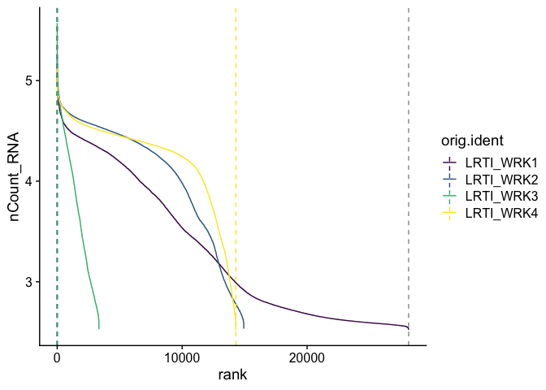
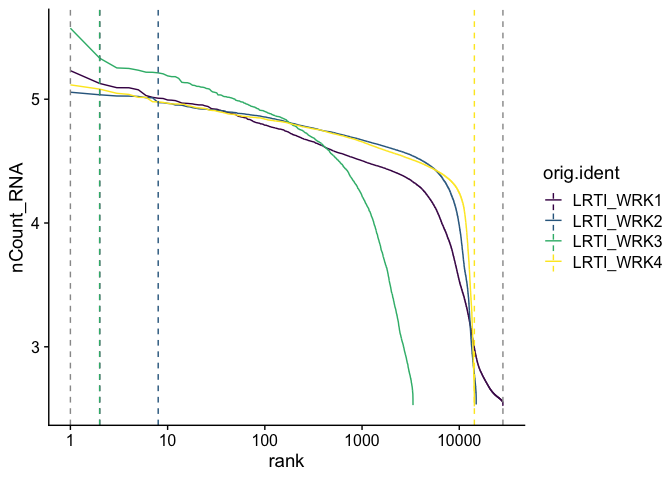
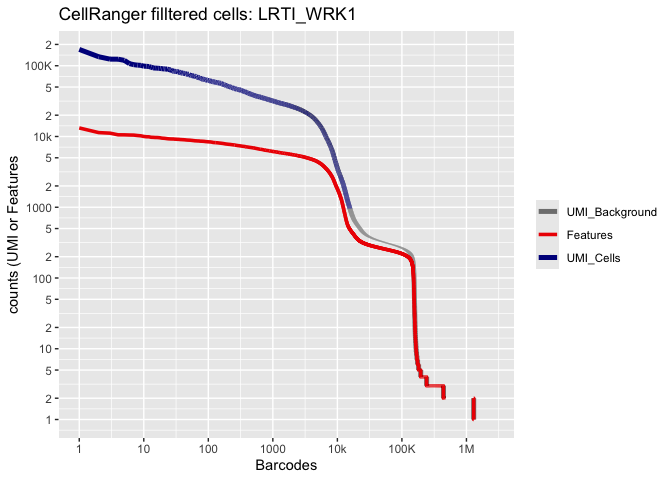
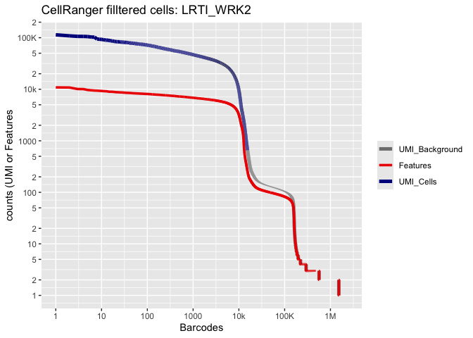

# Introduction to Single Cell RNA-Seq Part 1: Create Seurat object


Our first Markdown analysis document concentrates on getting data into R and setting up our initial object. We will also replicate some of the tables and figures found in the Cellranger web summary.

### Load packages
We will start each section by loading the libraries necessary for that portion of the analysis.

``` r
library(Seurat)     # single cell RNA-Seq analysis
library(kableExtra) # format tables
library(ggplot2)   # create graphics
library(viridis)   # accessible color palettes
<div class='r_output'>
 Experiment metadata
The 10X data and metadata we have available for this subset of a recent experiment conducted at UCSF of LRTI (Lower Respiratory Tack Infection) sample during this workshop is very basic; we don't have any batches or conditions. I have also modified the read counts a little bit, so its essentially fake data.

# Setup the experiment folder and data info
<table class="table table-striped" style="margin-left: auto; margin-right: auto;">
 <thead>
  <tr>
   <th style="text-align:left;"> ids </th>
   <th style="text-align:left;"> group </th>
   <th style="text-align:left;"> run </th>
  </tr>
 </thead>
<tbody>
  <tr>
   <td style="text-align:left;"> LRTI_WRK1 </td>
   <td style="text-align:left;"> LRTI_Patient </td>
   <td style="text-align:left;"> Batch1 </td>
  </tr>
  <tr>
   <td style="text-align:left;"> LRTI_WRK2 </td>
   <td style="text-align:left;"> LRTI_Patient </td>
   <td style="text-align:left;"> Batch1 </td>
  </tr>
</tbody>
</table>

 Cell Ranger sample metrics


This roughly replicates the table that appears in the Cell Ranger web summary file.
<table class="table table-striped" style="margin-left: auto; margin-right: auto;">
<caption>GXP Cell Ranger Results</caption>
 <thead>
  <tr>
   <th style="text-align:left;">  </th>
   <th style="text-align:left;"> LRTI_WRK1 </th>
   <th style="text-align:left;"> LRTI_WRK2 </th>
  </tr>
 </thead>
<tbody>
  <tr grouplength="3"><td colspan="3" style="background-color: #666; color: #fff;"><strong>Overview</strong></td></tr>
<tr>
   <td style="text-align:left;padding-left: 2em;" indentlevel="1"> Estimated Number of Cells </td>
   <td style="text-align:left;"> 15,663 </td>
   <td style="text-align:left;"> 15,431 </td>
  </tr>
  <tr>
   <td style="text-align:left;padding-left: 2em;" indentlevel="1"> Mean Reads per Cell </td>
   <td style="text-align:left;"> 50,750 </td>
   <td style="text-align:left;"> 51,767 </td>
  </tr>
  <tr>
   <td style="text-align:left;padding-left: 2em;" indentlevel="1"> Median Genes per Cell </td>
   <td style="text-align:left;"> 2,938 </td>
   <td style="text-align:left;"> 4,631 </td>
  </tr>
  <tr grouplength="6"><td colspan="3" style="background-color: #666; color: #fff;"><strong>Sequencing Characteristics</strong></td></tr>
<tr>
   <td style="text-align:left;padding-left: 2em;" indentlevel="1"> Number of Reads </td>
   <td style="text-align:left;"> 794,894,162 </td>
   <td style="text-align:left;"> 798,812,047 </td>
  </tr>
  <tr>
   <td style="text-align:left;padding-left: 2em;" indentlevel="1"> Valid Barcodes </td>
   <td style="text-align:left;"> 84.8% </td>
   <td style="text-align:left;"> 87.3% </td>
  </tr>
  <tr>
   <td style="text-align:left;padding-left: 2em;" indentlevel="1"> Sequencing Saturation </td>
   <td style="text-align:left;"> 34.9% </td>
   <td style="text-align:left;"> 34.1% </td>
  </tr>
  <tr>
   <td style="text-align:left;padding-left: 2em;" indentlevel="1"> Q30 Bases in Barcode </td>
   <td style="text-align:left;"> 95.8% </td>
   <td style="text-align:left;"> 96.3% </td>
  </tr>
  <tr>
   <td style="text-align:left;padding-left: 2em;" indentlevel="1"> Q30 Bases in RNA Read </td>
   <td style="text-align:left;"> 94.8% </td>
   <td style="text-align:left;"> 96.1% </td>
  </tr>
  <tr>
   <td style="text-align:left;padding-left: 2em;" indentlevel="1"> Q30 Bases in UMI </td>
   <td style="text-align:left;"> 97.3% </td>
   <td style="text-align:left;"> 97.5% </td>
  </tr>
  <tr grouplength="10"><td colspan="3" style="background-color: #666; color: #fff;"><strong>Mapping Characteristics</strong></td></tr>
<tr>
   <td style="text-align:left;padding-left: 2em;" indentlevel="1"> Reads Mapped to Genome </td>
   <td style="text-align:left;"> 94.4% </td>
   <td style="text-align:left;"> 96.3% </td>
  </tr>
  <tr>
   <td style="text-align:left;padding-left: 2em;" indentlevel="1"> Reads Mapped Confidently to Genome </td>
   <td style="text-align:left;"> 57.7% </td>
   <td style="text-align:left;"> 78.6% </td>
  </tr>
  <tr>
   <td style="text-align:left;padding-left: 2em;" indentlevel="1"> Reads Mapped Confidently to Intergenic Regions </td>
   <td style="text-align:left;"> 6.3% </td>
   <td style="text-align:left;"> 5.3% </td>
  </tr>
  <tr>
   <td style="text-align:left;padding-left: 2em;" indentlevel="1"> Reads Mapped Confidently to Intronic Regions </td>
   <td style="text-align:left;"> 7.2% </td>
   <td style="text-align:left;"> 5.9% </td>
  </tr>
  <tr>
   <td style="text-align:left;padding-left: 2em;" indentlevel="1"> Reads Mapped Confidently to Exonic Regions </td>
   <td style="text-align:left;"> 44.2% </td>
   <td style="text-align:left;"> 67.4% </td>
  </tr>
  <tr>
   <td style="text-align:left;padding-left: 2em;" indentlevel="1"> Reads Mapped Confidently to Transcriptome </td>
   <td style="text-align:left;"> 46.4% </td>
   <td style="text-align:left;"> 66.2% </td>
  </tr>
  <tr>
   <td style="text-align:left;padding-left: 2em;" indentlevel="1"> Reads Mapped Antisense to Gene </td>
   <td style="text-align:left;"> 4.7% </td>
   <td style="text-align:left;"> 6.7% </td>
  </tr>
  <tr>
   <td style="text-align:left;padding-left: 2em;" indentlevel="1"> Fraction Reads in Cells </td>
   <td style="text-align:left;"> 81.1% </td>
   <td style="text-align:left;"> 94.1% </td>
  </tr>
  <tr>
   <td style="text-align:left;padding-left: 2em;" indentlevel="1"> Total Genes Detected </td>
   <td style="text-align:left;"> 32,136 </td>
   <td style="text-align:left;"> 30,533 </td>
  </tr>
  <tr>
   <td style="text-align:left;padding-left: 2em;" indentlevel="1"> Median UMI Counts per Cell </td>
   <td style="text-align:left;"> 7,253 </td>
   <td style="text-align:left;"> 19,299 </td>
  </tr>
</tbody>
</table>

 Create Seurat object
We will be using [Seurat](http://satijalab.org/seurat/) as the basis of our single cell (or nucleus) RNA-Seq analysis. Seurat is a popular R package that is designed for QC, analysis, and exploration of single cell data, which aims to enable users to identify and interpret sources of heterogeneity from single cell transcriptomic measurements, and to integrate diverse types of single cell data.
In addition to the standard Seurat workflow, this documentation makes use of some custom code, and brings in functions from other packages. For additional information on Seurat standard workflows, see the authors' [tutorials](https://satijalab.org/seurat/vignettes.html).

# Read in expression matrix
First, we read in data from each individual sample folder.

``` r
expression.data <- lapply(experiment.metadata$id, function(i){
  sample.matrix = Read10X_h5(file.path(dataset_loc, paste0(i,"_GXP"), "outs","raw_feature_bc_matrix.h5"))
  colnames(sample.matrix) = paste(sapply(strsplit(colnames(sample.matrix),split="-"), '[[', 1L), i, sep="+")
  sample.matrix
})
names(expression.data) <- experiment.metadata$id
</div>

``` r
View(expression.data)
<div class='r_output'>
# Merge matrices

``` r
aggregate.data <- do.call("cbind", expression.data)
</div>
### Create Seurat Object

The `CreateSeuratObject` function allows feature (gene) and cell filtering by minimum cell and feature counts. We will set these to low numbers for now in order to explore manual filtering more fully in part 2.

``` r
gxp_experiment.aggregate <- CreateSeuratObject(
  aggregate.data,
  project = experiment_name,
  min.cells = 0,
  min.features = 300,
  names.field = 2, # tells Seurat which part of the cell identifier contains the sample name
  names.delim = "\\+")
<div class='r_output'>
 Add metadata
We can now attach the metadata in our table to the Seurat object.

# Match metadata to expression matrix
The columns of the expression matrix correspond to the cells in the experiment. When we created the Seurat object, the "names.field" and "names.delim" arguments allowed Seurat to infer sample identity from the cell names. This information is stored in a variable called "orig.ident."

``` r
levels(gxp_experiment.aggregate$orig.ident)
</div>
<div class='r_output'> [1] "LRTI_WRK1" "LRTI_WRK2"
</div>
These sample identifiers are stored in the experiment.metadata object as well, which allows us to match the other metadata contained within that table to the correct cells within the Seurat object.

``` r
sample.index <- match(gxp_experiment.aggregate$orig.ident, experiment.metadata$id)
<div class='r_output'>
# Attach metadata
The AddMetaData function returns a new Seurat object with an additional column in the metadata table containing the new information.

``` r
gxp_experiment.aggregate[["group"]] <- factor(experiment.metadata$group[sample.index])

gxp_experiment.aggregate[["run"]] <- factor(experiment.metadata$run[sample.index])
</div>

### Add in percentage of reads that map to the mitochondrial genome

Filtering on the expression of genes from the mitochondrial genome is not appropriate in all cell types. However, in many tissues, low-quality / dying cells may exhibit extensive mitochondrial contamination. Even when not filtering on mitochondrial expression, the data can be interesting or informative.

The `PercentageFeatureSet` function calculates the proportion of counts originating from a set of features. Genes in the human mitochondrial genome begin with 'MT', while those in the mouse mitochondrial genome begin with 'mt'. These naming conventions make calculating percent mitochondrial very straightforward.

* Low-quality / dying cells often exhibit extensive mitochondrial contamination.
* We use the set of all genes, in human these genes can be identified as those that begin with 'MT'.


#### Add in percentage of reads that map to the ribosomal genes

Ribosomal genes also can also be highly represented, and can vary between cell types.
So its of interest to see how prevalent they are in the data.
We are selecting ribosomal protein genes rather than the actual rRNA, so they’re more a measure of the translational activity of the cell rather than the cleanliness of the polyA selection.


``` r
gxp_experiment.aggregate[["percent.ribosomal"]] <- PercentageFeatureSet(gxp_experiment.aggregate, pattern = "^RP[LS]")
<div class='r_output'>

 Explore the Seurat object
A Seurat object is a complex data structure containing the data from a single cell or single nucleus assay and **all** of the information associated with the experiment, including annotations, analysis, and more. This data structure was developed by the authors of the Seurat analysis package, for use with their pipeline.

``` r
View(gxp_experiment.aggregate)
</div>
Most Seurat functions take the object as an argument, and return either a new Seurat object or a ggplot object (a visualization). As the analysis continues, more and more data will be added to the object.


``` r
slotNames(gxp_experiment.aggregate)
<div class='r_output'>
</div>##  [1] "assays"       "meta.data"    "active.assay" "active.ident" "graphs"      
##  [6] "neighbors"    "reductions"   "images"       "project.name" "misc"        
## [11] "version"      "commands"     "tools"
<div class='r_output'>
``` r
gxp_experiment.aggregate@assays # a slot is accessed with the @ symbol
</div>
<div class='r_output'> $RNA
 Assay (v5) data with 38606 features for 39196 cells
 First 10 features:
  DDX11L2, MIR1302-2HG, FAM138A, ENSG00000290826, OR4F5, ENSG00000238009,
 ENSG00000239945, ENSG00000239906, ENSG00000241860, ENSG00000241599 
 Layers:
  counts
</div>- Which slots are empty, and which contain data?
- What type of object is the content of the meta.data slot?
- What metadata is available?

There is often more than one way to interact with the information stored in each of a Seurat objects many slots. The default behaviors of different access functions are described in the help documentation.


``` r
# which slot is being accessed here? find another way to produce the result
head(gxp_experiment.aggregate[[]]) %>%
  kable() %>%
  kable_styling("striped")
<div class='r_output'>
<table class="table table-striped" style="margin-left: auto; margin-right: auto;">
 <thead>
  <tr>
   <th style="text-align:left;">  </th>
   <th style="text-align:left;"> orig.ident </th>
   <th style="text-align:right;"> nCount_RNA </th>
   <th style="text-align:right;"> nFeature_RNA </th>
   <th style="text-align:left;"> group </th>
   <th style="text-align:left;"> run </th>
   <th style="text-align:right;"> percent.mito </th>
   <th style="text-align:right;"> percent.ribosomal </th>
  </tr>
 </thead>
<tbody>
  <tr>
   <td style="text-align:left;"> AAACCAAAGACGACGA+LRTI_WRK1 </td>
   <td style="text-align:left;"> LRTI_WRK1 </td>
   <td style="text-align:right;"> 1154 </td>
   <td style="text-align:right;"> 304 </td>
   <td style="text-align:left;"> LRTI_Patient </td>
   <td style="text-align:left;"> Batch1 </td>
   <td style="text-align:right;"> 68.1109185 </td>
   <td style="text-align:right;"> 1.7331023 </td>
  </tr>
  <tr>
   <td style="text-align:left;"> AAACCAAAGAGCCCAT+LRTI_WRK1 </td>
   <td style="text-align:left;"> LRTI_WRK1 </td>
   <td style="text-align:right;"> 17004 </td>
   <td style="text-align:right;"> 4736 </td>
   <td style="text-align:left;"> LRTI_Patient </td>
   <td style="text-align:left;"> Batch1 </td>
   <td style="text-align:right;"> 3.7697012 </td>
   <td style="text-align:right;"> 15.6080922 </td>
  </tr>
  <tr>
   <td style="text-align:left;"> AAACCAAAGAGGCGTA+LRTI_WRK1 </td>
   <td style="text-align:left;"> LRTI_WRK1 </td>
   <td style="text-align:right;"> 391 </td>
   <td style="text-align:right;"> 323 </td>
   <td style="text-align:left;"> LRTI_Patient </td>
   <td style="text-align:left;"> Batch1 </td>
   <td style="text-align:right;"> 0.2557545 </td>
   <td style="text-align:right;"> 4.6035806 </td>
  </tr>
  <tr>
   <td style="text-align:left;"> AAACCAAAGATTCAAC+LRTI_WRK1 </td>
   <td style="text-align:left;"> LRTI_WRK1 </td>
   <td style="text-align:right;"> 3225 </td>
   <td style="text-align:right;"> 1735 </td>
   <td style="text-align:left;"> LRTI_Patient </td>
   <td style="text-align:left;"> Batch1 </td>
   <td style="text-align:right;"> 4.4651163 </td>
   <td style="text-align:right;"> 0.5581395 </td>
  </tr>
  <tr>
   <td style="text-align:left;"> AAACCAAAGCAACCCG+LRTI_WRK1 </td>
   <td style="text-align:left;"> LRTI_WRK1 </td>
   <td style="text-align:right;"> 1097 </td>
   <td style="text-align:right;"> 823 </td>
   <td style="text-align:left;"> LRTI_Patient </td>
   <td style="text-align:left;"> Batch1 </td>
   <td style="text-align:right;"> 8.1130356 </td>
   <td style="text-align:right;"> 3.7374658 </td>
  </tr>
  <tr>
   <td style="text-align:left;"> AAACCAAAGCCGCCAA+LRTI_WRK1 </td>
   <td style="text-align:left;"> LRTI_WRK1 </td>
   <td style="text-align:right;"> 723 </td>
   <td style="text-align:right;"> 313 </td>
   <td style="text-align:left;"> LRTI_Patient </td>
   <td style="text-align:left;"> Batch1 </td>
   <td style="text-align:right;"> 53.5269710 </td>
   <td style="text-align:right;"> 3.3195021 </td>
  </tr>
</tbody>
</table>

The use of syntax is often a matter of personal preference. In the interest of clarity, this documentation will generally use the more explicit syntax, with a few exceptions.

 Barcode inflection plots

Imagine the barcode rank plot from the Cell Ranger web summary. That graphic plots the number of UMIs against the barcode rank, and typically has a sharp inflection point where the number of UMIs drops dramatically. These points can represent a transition between cell types from a higher RNA content population to a lower RNA content population, or from cell-associated barcodes to background.

The Seurat `BarcodeInflectionsPlot` provides a similar graphic.


``` r
gxp_experiment.aggregate <- CalculateBarcodeInflections(gxp_experiment.aggregate)
BarcodeInflectionsPlot(gxp_experiment.aggregate) +
  scale_color_viridis_d()
</div>
<!-- -->

Adding a log-scale transformation to the x-axis increases the resemblance to the Cell Ranger plot. Values on the y-axis are already log-transformed.


``` r
BarcodeInflectionsPlot(gxp_experiment.aggregate) +
  scale_x_continuous(trans = "log10") +
  scale_color_viridis_d()
<div class='r_output'>
<!-- -->

``` r
gxp_experiment.aggregate@tools$CalculateBarcodeInflections$inflection_points %>%
  kable() %>%
  kable_styling("striped")
</div>
<table class="table table-striped" style="margin-left: auto; margin-right: auto;">
 <thead>
  <tr>
   <th style="text-align:left;">  </th>
   <th style="text-align:left;"> orig.ident </th>
   <th style="text-align:right;"> nCount_RNA </th>
   <th style="text-align:right;"> rank </th>
  </tr>
 </thead>
<tbody>
  <tr>
   <td style="text-align:left;"> GTTGACATCGCCCTTA+LRTI_WRK1 </td>
   <td style="text-align:left;"> LRTI_WRK1 </td>
   <td style="text-align:right;"> 119888 </td>
   <td style="text-align:right;"> 2 </td>
  </tr>
  <tr>
   <td style="text-align:left;"> CGTAAATTCAGCCTCC+LRTI_WRK2 </td>
   <td style="text-align:left;"> LRTI_WRK2 </td>
   <td style="text-align:right;"> 83139 </td>
   <td style="text-align:right;"> 8 </td>
  </tr>
</tbody>
</table>

``` r
SubsetByBarcodeInflections(object = gxp_experiment.aggregate)
<div class='r_output'>
## 38606 features across 6 samples within 1 assay 
## Active assay: RNA (38606 features, 0 variable features)
##  1 layer present: counts
<div class='r_output'>
Lets recreate the pretty Cell Ranger html plot




 Prepare for the next section

 Save object

``` r
saveRDS(gxp_experiment.aggregate, file="scRNA_workshop-01.rds")

</div>
#### Download Rmd

``` r
download.file("https://raw.githubusercontent.com/ucsf-cat-bioinformatics/2024-08-SCRNA-Seq-Analysis/main/data_analysis/02-filtering.Rmd", "02-filtering.Rmd")
<div class='r_output'>
 Session information

``` r
sessionInfo()
</div>
<div class='r_output'> R version 4.4.1 (2024-06-14)
 Platform: aarch64-apple-darwin20
 Running under: macOS Sonoma 14.6.1
 
 Matrix products: default
 BLAS:   /Library/Frameworks/R.framework/Versions/4.4-arm64/Resources/lib/libRblas.0.dylib 
 LAPACK: /Library/Frameworks/R.framework/Versions/4.4-arm64/Resources/lib/libRlapack.dylib;  LAPACK version 3.12.0
 
 locale:
 [1] en_US.UTF-8/en_US.UTF-8/en_US.UTF-8/C/en_US.UTF-8/en_US.UTF-8
 
 time zone: America/Los_Angeles
 tzcode source: internal
 
 attached base packages:
 [1] stats     graphics  grDevices utils     datasets  methods   base     
 
 other attached packages:
 [1] viridis_0.6.5      viridisLite_0.4.2  ggplot2_3.5.1      kableExtra_1.4.0  
 [5] Seurat_5.1.0       SeuratObject_5.0.2 sp_2.1-4          
 
 loaded via a namespace (and not attached):
   [1] RColorBrewer_1.1-3     rstudioapi_0.16.0      jsonlite_1.8.8        
   [4] magrittr_2.0.3         spatstat.utils_3.1-0   farver_2.1.2          
   [7] rmarkdown_2.28         vctrs_0.6.5            ROCR_1.0-11           
  [10] spatstat.explore_3.3-2 htmltools_0.5.8.1      sass_0.4.9            
  [13] sctransform_0.4.1      parallelly_1.38.0      KernSmooth_2.23-24    
  [16] bslib_0.8.0            htmlwidgets_1.6.4      ica_1.0-3             
  [19] plyr_1.8.9             plotly_4.10.4          zoo_1.8-12            
  [22] cachem_1.1.0           igraph_2.0.3           mime_0.12             
  [25] lifecycle_1.0.4        pkgconfig_2.0.3        Matrix_1.7-0          
  [28] R6_2.5.1               fastmap_1.2.0          fitdistrplus_1.2-1    
  [31] future_1.34.0          shiny_1.9.1            digest_0.6.37         
  [34] colorspace_2.1-1       patchwork_1.2.0        tensor_1.5            
  [37] RSpectra_0.16-2        irlba_2.3.5.1          labeling_0.4.3        
  [40] progressr_0.14.0       fansi_1.0.6            spatstat.sparse_3.1-0 
  [43] httr_1.4.7             polyclip_1.10-7        abind_1.4-5           
  [46] compiler_4.4.1         bit64_4.0.5            withr_3.0.1           
  [49] fastDummies_1.7.4      highr_0.11             MASS_7.3-61           
  [52] tools_4.4.1            lmtest_0.9-40          httpuv_1.6.15         
  [55] future.apply_1.11.2    goftest_1.2-3          glue_1.7.0            
  [58] nlme_3.1-166           promises_1.3.0         grid_4.4.1            
  [61] Rtsne_0.17             cluster_2.1.6          reshape2_1.4.4        
  [64] generics_0.1.3         hdf5r_1.3.11           gtable_0.3.5          
  [67] spatstat.data_3.1-2    tidyr_1.3.1            data.table_1.15.4     
  [70] xml2_1.3.6             utf8_1.2.4             spatstat.geom_3.3-2   
  [73] RcppAnnoy_0.0.22       ggrepel_0.9.5          RANN_2.6.2            
  [76] pillar_1.9.0           stringr_1.5.1          spam_2.10-0           
  [79] RcppHNSW_0.6.0         later_1.3.2            splines_4.4.1         
  [82] dplyr_1.1.4            lattice_0.22-6         survival_3.7-0        
  [85] bit_4.0.5              deldir_2.0-4           tidyselect_1.2.1      
  [88] miniUI_0.1.1.1         pbapply_1.7-2          knitr_1.48            
  [91] gridExtra_2.3          svglite_2.1.3          scattermore_1.2       
  [94] xfun_0.47              matrixStats_1.3.0      stringi_1.8.4         
  [97] lazyeval_0.2.2         yaml_2.3.10            evaluate_0.24.0       
 [100] codetools_0.2-20       tibble_3.2.1           cli_3.6.3             
 [103] uwot_0.2.2             xtable_1.8-4           reticulate_1.38.0     
 [106] systemfonts_1.1.0      munsell_0.5.1          jquerylib_0.1.4       
 [109] Rcpp_1.0.13            globals_0.16.3         spatstat.random_3.3-1 
 [112] png_0.1-8              spatstat.univar_3.0-0  parallel_4.4.1        
 [115] dotCall64_1.1-1        listenv_0.9.1          scales_1.3.0          
 [118] ggridges_0.5.6         leiden_0.4.3.1         purrr_1.0.2           
 [121] rlang_1.1.4            cowplot_1.1.3
</div>