# Introduction to Single Cell RNA-Seq Part 2: QA and filtering


## Set up workspace
First, we need to load the required libraries.

``` r
library(Seurat)
library(ggplot2)
library(tidyr)
library(dplyr)
library(kableExtra)
```

If you are continuing directly from part 1, the experiment.aggregate object is likely already in your workspace. In case you cleared your workspace at the end of the previous section, or are working on this project at a later date after re-starting R, you can use the `readRDS` function to read your saved Seurat object from part 1.


``` r
experiment.aggregate <- readRDS("scRNA_workshop-01.rds")
experiment.aggregate
```

```
## An object of class Seurat 
## 38606 features across 60697 samples within 1 assay 
## Active assay: RNA (38606 features, 0 variable features)
##  1 layer present: counts
```

#### First lets look at the number of valid cells in each batch

<table class="table table-striped" style="margin-left: auto; margin-right: auto;">
<caption>Cell counts per sample</caption>
 <thead>
  <tr>
   <th style="text-align:left;"> Sample </th>
   <th style="text-align:right;"> Number of Cells </th>
  </tr>
 </thead>
<tbody>
  <tr>
   <td style="text-align:left;"> LRTI_WRK1 </td>
   <td style="text-align:right;"> 28124 </td>
  </tr>
  <tr>
   <td style="text-align:left;"> LRTI_WRK2 </td>
   <td style="text-align:right;"> 14933 </td>
  </tr>
  <tr>
   <td style="text-align:left;"> LRTI_WRK3 </td>
   <td style="text-align:right;"> 3343 </td>
  </tr>
  <tr>
   <td style="text-align:left;"> LRTI_WRK4 </td>
   <td style="text-align:right;"> 14297 </td>
  </tr>
</tbody>
</table>

A seed is used to initialize pseudo-random functions. Some of the functions we will be using have pseudo-random elements. Setting a common seed ensures that all of us will get the same results, and that the results will remain stable when re-run.

``` r
set.seed(12345)
```

## Display metadata QA/QC

Using a few nested functions, we can produce prettier, more detailed, versions of the simple exploratory summary statistics we generated for the available metadata in the last section. In the code below sections below,

Further, Seurat has a number of convenient built-in functions for visualizing metadata. These functions produce ggplot objects, which can easily be modified using ggplot2. Of course, all of these visualizations can be reproduced with custom code as well, and we will include some examples of both modifying Seurat plots and generating plots from scratch as the analysis continues.

1) 10% quantile tables are produced for each metadata value, separated by sample identity.
2) Ridge Plot
3) Violin Plot

Each is a different way of looking at the data as to get a better understanding of how each sample compares

#### Feature counts (genes) per cell
<table class="table table-striped" style="margin-left: auto; margin-right: auto;">
<caption>Feature count distribution by sample</caption>
 <thead>
  <tr>
   <th style="text-align:left;">  </th>
   <th style="text-align:right;"> LRTI_WRK1 </th>
   <th style="text-align:right;"> LRTI_WRK2 </th>
   <th style="text-align:right;"> LRTI_WRK3 </th>
   <th style="text-align:right;"> LRTI_WRK4 </th>
  </tr>
 </thead>
<tbody>
  <tr>
   <td style="text-align:left;"> 0% </td>
   <td style="text-align:right;"> 300.00 </td>
   <td style="text-align:right;"> 300.0 </td>
   <td style="text-align:right;"> 300.0 </td>
   <td style="text-align:right;"> 300.0 </td>
  </tr>
  <tr>
   <td style="text-align:left;"> 5% </td>
   <td style="text-align:right;"> 305.00 </td>
   <td style="text-align:right;"> 387.0 </td>
   <td style="text-align:right;"> 337.1 </td>
   <td style="text-align:right;"> 701.4 </td>
  </tr>
  <tr>
   <td style="text-align:left;"> 10% </td>
   <td style="text-align:right;"> 311.00 </td>
   <td style="text-align:right;"> 522.2 </td>
   <td style="text-align:right;"> 375.0 </td>
   <td style="text-align:right;"> 1671.0 </td>
  </tr>
  <tr>
   <td style="text-align:left;"> 15% </td>
   <td style="text-align:right;"> 320.00 </td>
   <td style="text-align:right;"> 993.6 </td>
   <td style="text-align:right;"> 435.3 </td>
   <td style="text-align:right;"> 2686.4 </td>
  </tr>
  <tr>
   <td style="text-align:left;"> 20% </td>
   <td style="text-align:right;"> 330.00 </td>
   <td style="text-align:right;"> 1650.0 </td>
   <td style="text-align:right;"> 499.4 </td>
   <td style="text-align:right;"> 3509.0 </td>
  </tr>
  <tr>
   <td style="text-align:left;"> 25% </td>
   <td style="text-align:right;"> 345.00 </td>
   <td style="text-align:right;"> 2104.0 </td>
   <td style="text-align:right;"> 585.0 </td>
   <td style="text-align:right;"> 3982.0 </td>
  </tr>
  <tr>
   <td style="text-align:left;"> 30% </td>
   <td style="text-align:right;"> 368.00 </td>
   <td style="text-align:right;"> 2789.0 </td>
   <td style="text-align:right;"> 727.6 </td>
   <td style="text-align:right;"> 4310.0 </td>
  </tr>
  <tr>
   <td style="text-align:left;"> 35% </td>
   <td style="text-align:right;"> 401.00 </td>
   <td style="text-align:right;"> 3472.0 </td>
   <td style="text-align:right;"> 908.0 </td>
   <td style="text-align:right;"> 4543.0 </td>
  </tr>
  <tr>
   <td style="text-align:left;"> 40% </td>
   <td style="text-align:right;"> 441.00 </td>
   <td style="text-align:right;"> 3981.8 </td>
   <td style="text-align:right;"> 1186.8 </td>
   <td style="text-align:right;"> 4732.0 </td>
  </tr>
  <tr>
   <td style="text-align:left;"> 45% </td>
   <td style="text-align:right;"> 494.00 </td>
   <td style="text-align:right;"> 4398.4 </td>
   <td style="text-align:right;"> 1699.6 </td>
   <td style="text-align:right;"> 4913.0 </td>
  </tr>
  <tr>
   <td style="text-align:left;"> 50% </td>
   <td style="text-align:right;"> 602.00 </td>
   <td style="text-align:right;"> 4725.0 </td>
   <td style="text-align:right;"> 2184.0 </td>
   <td style="text-align:right;"> 5066.0 </td>
  </tr>
  <tr>
   <td style="text-align:left;"> 55% </td>
   <td style="text-align:right;"> 900.30 </td>
   <td style="text-align:right;"> 5011.0 </td>
   <td style="text-align:right;"> 2617.1 </td>
   <td style="text-align:right;"> 5212.8 </td>
  </tr>
  <tr>
   <td style="text-align:left;"> 60% </td>
   <td style="text-align:right;"> 1386.00 </td>
   <td style="text-align:right;"> 5260.0 </td>
   <td style="text-align:right;"> 3196.0 </td>
   <td style="text-align:right;"> 5347.0 </td>
  </tr>
  <tr>
   <td style="text-align:left;"> 65% </td>
   <td style="text-align:right;"> 1886.90 </td>
   <td style="text-align:right;"> 5496.0 </td>
   <td style="text-align:right;"> 3785.0 </td>
   <td style="text-align:right;"> 5493.0 </td>
  </tr>
  <tr>
   <td style="text-align:left;"> 70% </td>
   <td style="text-align:right;"> 2616.10 </td>
   <td style="text-align:right;"> 5691.0 </td>
   <td style="text-align:right;"> 4287.2 </td>
   <td style="text-align:right;"> 5630.0 </td>
  </tr>
  <tr>
   <td style="text-align:left;"> 75% </td>
   <td style="text-align:right;"> 3352.00 </td>
   <td style="text-align:right;"> 5894.0 </td>
   <td style="text-align:right;"> 4799.5 </td>
   <td style="text-align:right;"> 5793.0 </td>
  </tr>
  <tr>
   <td style="text-align:left;"> 80% </td>
   <td style="text-align:right;"> 4076.40 </td>
   <td style="text-align:right;"> 6099.0 </td>
   <td style="text-align:right;"> 5387.4 </td>
   <td style="text-align:right;"> 5960.0 </td>
  </tr>
  <tr>
   <td style="text-align:left;"> 85% </td>
   <td style="text-align:right;"> 4682.00 </td>
   <td style="text-align:right;"> 6311.2 </td>
   <td style="text-align:right;"> 5961.0 </td>
   <td style="text-align:right;"> 6178.6 </td>
  </tr>
  <tr>
   <td style="text-align:left;"> 90% </td>
   <td style="text-align:right;"> 5221.70 </td>
   <td style="text-align:right;"> 6580.0 </td>
   <td style="text-align:right;"> 6703.8 </td>
   <td style="text-align:right;"> 6460.0 </td>
  </tr>
  <tr>
   <td style="text-align:left;"> 95% </td>
   <td style="text-align:right;"> 5836.85 </td>
   <td style="text-align:right;"> 7010.0 </td>
   <td style="text-align:right;"> 7645.3 </td>
   <td style="text-align:right;"> 6982.2 </td>
  </tr>
  <tr>
   <td style="text-align:left;"> 100% </td>
   <td style="text-align:right;"> 13205.00 </td>
   <td style="text-align:right;"> 10859.0 </td>
   <td style="text-align:right;"> 13321.0 </td>
   <td style="text-align:right;"> 9953.0 </td>
  </tr>
</tbody>
</table>

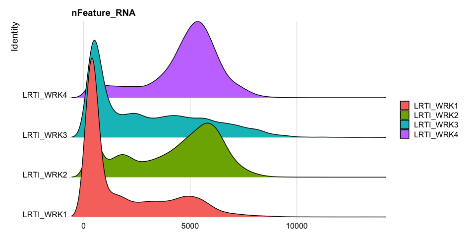<!-- -->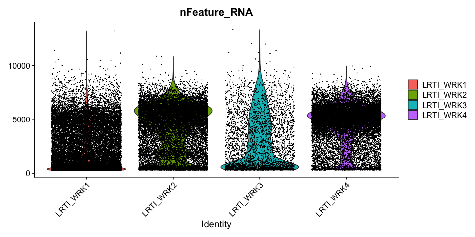<!-- -->

#### UMI counts per cell

<table class="table table-striped" style="margin-left: auto; margin-right: auto;">
<caption>UMI count distribution by sample</caption>
 <thead>
  <tr>
   <th style="text-align:left;">  </th>
   <th style="text-align:right;"> LRTI_WRK1 </th>
   <th style="text-align:right;"> LRTI_WRK2 </th>
   <th style="text-align:right;"> LRTI_WRK3 </th>
   <th style="text-align:right;"> LRTI_WRK4 </th>
  </tr>
 </thead>
<tbody>
  <tr>
   <td style="text-align:left;"> 0% </td>
   <td style="text-align:right;"> 333.00 </td>
   <td style="text-align:right;"> 341.0 </td>
   <td style="text-align:right;"> 337.0 </td>
   <td style="text-align:right;"> 329.0 </td>
  </tr>
  <tr>
   <td style="text-align:left;"> 5% </td>
   <td style="text-align:right;"> 374.00 </td>
   <td style="text-align:right;"> 633.0 </td>
   <td style="text-align:right;"> 548.0 </td>
   <td style="text-align:right;"> 1550.4 </td>
  </tr>
  <tr>
   <td style="text-align:left;"> 10% </td>
   <td style="text-align:right;"> 387.00 </td>
   <td style="text-align:right;"> 989.0 </td>
   <td style="text-align:right;"> 663.0 </td>
   <td style="text-align:right;"> 3475.0 </td>
  </tr>
  <tr>
   <td style="text-align:left;"> 15% </td>
   <td style="text-align:right;"> 402.00 </td>
   <td style="text-align:right;"> 1989.2 </td>
   <td style="text-align:right;"> 822.0 </td>
   <td style="text-align:right;"> 7046.8 </td>
  </tr>
  <tr>
   <td style="text-align:left;"> 20% </td>
   <td style="text-align:right;"> 421.00 </td>
   <td style="text-align:right;"> 3332.4 </td>
   <td style="text-align:right;"> 999.0 </td>
   <td style="text-align:right;"> 11645.6 </td>
  </tr>
  <tr>
   <td style="text-align:left;"> 25% </td>
   <td style="text-align:right;"> 448.00 </td>
   <td style="text-align:right;"> 4581.0 </td>
   <td style="text-align:right;"> 1217.5 </td>
   <td style="text-align:right;"> 15134.0 </td>
  </tr>
  <tr>
   <td style="text-align:left;"> 30% </td>
   <td style="text-align:right;"> 489.00 </td>
   <td style="text-align:right;"> 7493.6 </td>
   <td style="text-align:right;"> 1642.2 </td>
   <td style="text-align:right;"> 17535.8 </td>
  </tr>
  <tr>
   <td style="text-align:left;"> 35% </td>
   <td style="text-align:right;"> 542.00 </td>
   <td style="text-align:right;"> 10957.2 </td>
   <td style="text-align:right;"> 2123.2 </td>
   <td style="text-align:right;"> 19545.8 </td>
  </tr>
  <tr>
   <td style="text-align:left;"> 40% </td>
   <td style="text-align:right;"> 614.20 </td>
   <td style="text-align:right;"> 14282.8 </td>
   <td style="text-align:right;"> 2790.8 </td>
   <td style="text-align:right;"> 21091.8 </td>
  </tr>
  <tr>
   <td style="text-align:left;"> 45% </td>
   <td style="text-align:right;"> 736.00 </td>
   <td style="text-align:right;"> 17231.0 </td>
   <td style="text-align:right;"> 3963.5 </td>
   <td style="text-align:right;"> 22609.4 </td>
  </tr>
  <tr>
   <td style="text-align:left;"> 50% </td>
   <td style="text-align:right;"> 1051.00 </td>
   <td style="text-align:right;"> 20197.0 </td>
   <td style="text-align:right;"> 5167.0 </td>
   <td style="text-align:right;"> 23955.0 </td>
  </tr>
  <tr>
   <td style="text-align:left;"> 55% </td>
   <td style="text-align:right;"> 1660.65 </td>
   <td style="text-align:right;"> 23045.8 </td>
   <td style="text-align:right;"> 6994.1 </td>
   <td style="text-align:right;"> 25328.0 </td>
  </tr>
  <tr>
   <td style="text-align:left;"> 60% </td>
   <td style="text-align:right;"> 2496.00 </td>
   <td style="text-align:right;"> 25809.2 </td>
   <td style="text-align:right;"> 9699.0 </td>
   <td style="text-align:right;"> 26753.6 </td>
  </tr>
  <tr>
   <td style="text-align:left;"> 65% </td>
   <td style="text-align:right;"> 3615.85 </td>
   <td style="text-align:right;"> 28400.8 </td>
   <td style="text-align:right;"> 12977.6 </td>
   <td style="text-align:right;"> 28163.8 </td>
  </tr>
  <tr>
   <td style="text-align:left;"> 70% </td>
   <td style="text-align:right;"> 6011.20 </td>
   <td style="text-align:right;"> 30822.4 </td>
   <td style="text-align:right;"> 16366.8 </td>
   <td style="text-align:right;"> 29885.4 </td>
  </tr>
  <tr>
   <td style="text-align:left;"> 75% </td>
   <td style="text-align:right;"> 8947.50 </td>
   <td style="text-align:right;"> 33341.0 </td>
   <td style="text-align:right;"> 21187.5 </td>
   <td style="text-align:right;"> 31696.0 </td>
  </tr>
  <tr>
   <td style="text-align:left;"> 80% </td>
   <td style="text-align:right;"> 13408.60 </td>
   <td style="text-align:right;"> 36139.0 </td>
   <td style="text-align:right;"> 27606.0 </td>
   <td style="text-align:right;"> 33712.6 </td>
  </tr>
  <tr>
   <td style="text-align:left;"> 85% </td>
   <td style="text-align:right;"> 18554.55 </td>
   <td style="text-align:right;"> 38939.4 </td>
   <td style="text-align:right;"> 35278.6 </td>
   <td style="text-align:right;"> 36513.2 </td>
  </tr>
  <tr>
   <td style="text-align:left;"> 90% </td>
   <td style="text-align:right;"> 23435.40 </td>
   <td style="text-align:right;"> 42897.6 </td>
   <td style="text-align:right;"> 46873.4 </td>
   <td style="text-align:right;"> 40754.0 </td>
  </tr>
  <tr>
   <td style="text-align:left;"> 95% </td>
   <td style="text-align:right;"> 29076.05 </td>
   <td style="text-align:right;"> 49827.2 </td>
   <td style="text-align:right;"> 67186.0 </td>
   <td style="text-align:right;"> 49096.0 </td>
  </tr>
  <tr>
   <td style="text-align:left;"> 100% </td>
   <td style="text-align:right;"> 170061.00 </td>
   <td style="text-align:right;"> 113899.0 </td>
   <td style="text-align:right;"> 374591.0 </td>
   <td style="text-align:right;"> 130605.0 </td>
  </tr>
</tbody>
</table>

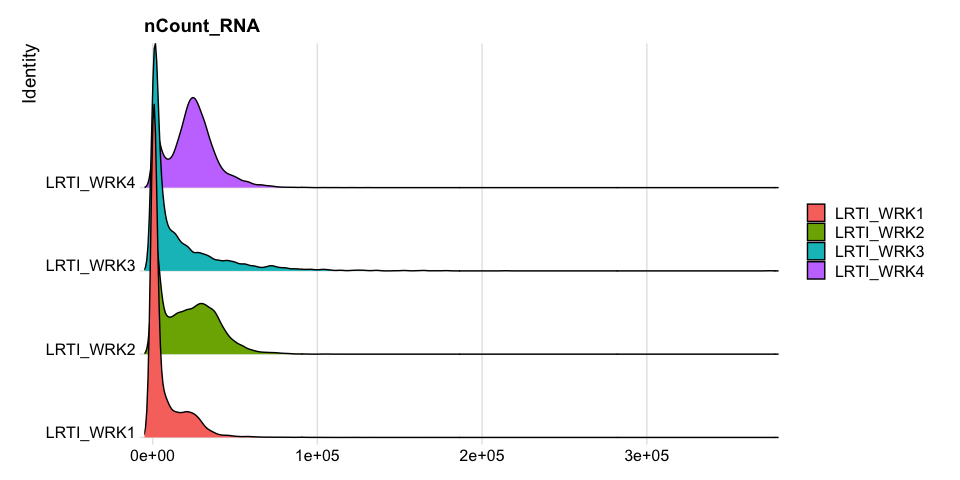<!-- -->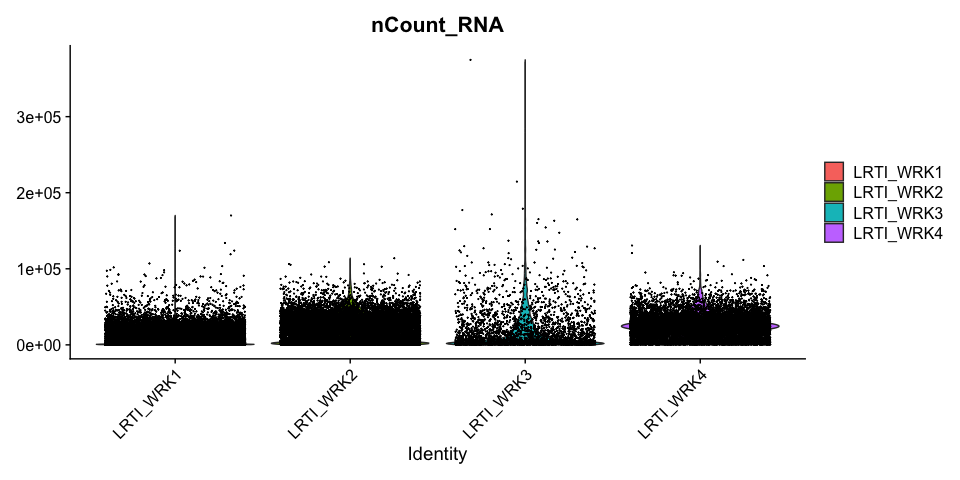<!-- -->

#### Percentage of Mitochondria per cell 

<table class="table table-striped" style="margin-left: auto; margin-right: auto;">
<caption>Mitochondrial percentage distribution by sample</caption>
 <thead>
  <tr>
   <th style="text-align:left;">  </th>
   <th style="text-align:right;"> LRTI_WRK1 </th>
   <th style="text-align:right;"> LRTI_WRK2 </th>
   <th style="text-align:right;"> LRTI_WRK3 </th>
   <th style="text-align:right;"> LRTI_WRK4 </th>
  </tr>
 </thead>
<tbody>
  <tr>
   <td style="text-align:left;"> 0% </td>
   <td style="text-align:right;"> 0.000 </td>
   <td style="text-align:right;"> 0.000 </td>
   <td style="text-align:right;"> 0.000 </td>
   <td style="text-align:right;"> 0.000 </td>
  </tr>
  <tr>
   <td style="text-align:left;"> 5% </td>
   <td style="text-align:right;"> 0.368 </td>
   <td style="text-align:right;"> 0.525 </td>
   <td style="text-align:right;"> 0.180 </td>
   <td style="text-align:right;"> 1.614 </td>
  </tr>
  <tr>
   <td style="text-align:left;"> 10% </td>
   <td style="text-align:right;"> 0.721 </td>
   <td style="text-align:right;"> 1.464 </td>
   <td style="text-align:right;"> 0.357 </td>
   <td style="text-align:right;"> 2.055 </td>
  </tr>
  <tr>
   <td style="text-align:left;"> 15% </td>
   <td style="text-align:right;"> 1.018 </td>
   <td style="text-align:right;"> 2.116 </td>
   <td style="text-align:right;"> 0.584 </td>
   <td style="text-align:right;"> 2.297 </td>
  </tr>
  <tr>
   <td style="text-align:left;"> 20% </td>
   <td style="text-align:right;"> 1.311 </td>
   <td style="text-align:right;"> 2.472 </td>
   <td style="text-align:right;"> 0.796 </td>
   <td style="text-align:right;"> 2.477 </td>
  </tr>
  <tr>
   <td style="text-align:left;"> 25% </td>
   <td style="text-align:right;"> 1.606 </td>
   <td style="text-align:right;"> 2.737 </td>
   <td style="text-align:right;"> 1.075 </td>
   <td style="text-align:right;"> 2.629 </td>
  </tr>
  <tr>
   <td style="text-align:left;"> 30% </td>
   <td style="text-align:right;"> 1.887 </td>
   <td style="text-align:right;"> 2.963 </td>
   <td style="text-align:right;"> 1.302 </td>
   <td style="text-align:right;"> 2.752 </td>
  </tr>
  <tr>
   <td style="text-align:left;"> 35% </td>
   <td style="text-align:right;"> 2.123 </td>
   <td style="text-align:right;"> 3.156 </td>
   <td style="text-align:right;"> 1.570 </td>
   <td style="text-align:right;"> 2.879 </td>
  </tr>
  <tr>
   <td style="text-align:left;"> 40% </td>
   <td style="text-align:right;"> 2.356 </td>
   <td style="text-align:right;"> 3.327 </td>
   <td style="text-align:right;"> 1.863 </td>
   <td style="text-align:right;"> 2.996 </td>
  </tr>
  <tr>
   <td style="text-align:left;"> 45% </td>
   <td style="text-align:right;"> 2.583 </td>
   <td style="text-align:right;"> 3.511 </td>
   <td style="text-align:right;"> 2.103 </td>
   <td style="text-align:right;"> 3.118 </td>
  </tr>
  <tr>
   <td style="text-align:left;"> 50% </td>
   <td style="text-align:right;"> 2.820 </td>
   <td style="text-align:right;"> 3.675 </td>
   <td style="text-align:right;"> 2.336 </td>
   <td style="text-align:right;"> 3.239 </td>
  </tr>
  <tr>
   <td style="text-align:left;"> 55% </td>
   <td style="text-align:right;"> 3.100 </td>
   <td style="text-align:right;"> 3.839 </td>
   <td style="text-align:right;"> 2.642 </td>
   <td style="text-align:right;"> 3.364 </td>
  </tr>
  <tr>
   <td style="text-align:left;"> 60% </td>
   <td style="text-align:right;"> 3.434 </td>
   <td style="text-align:right;"> 4.017 </td>
   <td style="text-align:right;"> 2.907 </td>
   <td style="text-align:right;"> 3.494 </td>
  </tr>
  <tr>
   <td style="text-align:left;"> 65% </td>
   <td style="text-align:right;"> 3.909 </td>
   <td style="text-align:right;"> 4.196 </td>
   <td style="text-align:right;"> 3.312 </td>
   <td style="text-align:right;"> 3.639 </td>
  </tr>
  <tr>
   <td style="text-align:left;"> 70% </td>
   <td style="text-align:right;"> 4.605 </td>
   <td style="text-align:right;"> 4.391 </td>
   <td style="text-align:right;"> 3.755 </td>
   <td style="text-align:right;"> 3.806 </td>
  </tr>
  <tr>
   <td style="text-align:left;"> 75% </td>
   <td style="text-align:right;"> 5.650 </td>
   <td style="text-align:right;"> 4.615 </td>
   <td style="text-align:right;"> 4.394 </td>
   <td style="text-align:right;"> 4.004 </td>
  </tr>
  <tr>
   <td style="text-align:left;"> 80% </td>
   <td style="text-align:right;"> 7.262 </td>
   <td style="text-align:right;"> 4.895 </td>
   <td style="text-align:right;"> 5.388 </td>
   <td style="text-align:right;"> 4.275 </td>
  </tr>
  <tr>
   <td style="text-align:left;"> 85% </td>
   <td style="text-align:right;"> 9.610 </td>
   <td style="text-align:right;"> 5.273 </td>
   <td style="text-align:right;"> 7.478 </td>
   <td style="text-align:right;"> 4.672 </td>
  </tr>
  <tr>
   <td style="text-align:left;"> 90% </td>
   <td style="text-align:right;"> 14.019 </td>
   <td style="text-align:right;"> 5.942 </td>
   <td style="text-align:right;"> 10.352 </td>
   <td style="text-align:right;"> 5.566 </td>
  </tr>
  <tr>
   <td style="text-align:left;"> 95% </td>
   <td style="text-align:right;"> 30.216 </td>
   <td style="text-align:right;"> 9.451 </td>
   <td style="text-align:right;"> 25.616 </td>
   <td style="text-align:right;"> 10.212 </td>
  </tr>
  <tr>
   <td style="text-align:left;"> 100% </td>
   <td style="text-align:right;"> 94.769 </td>
   <td style="text-align:right;"> 87.811 </td>
   <td style="text-align:right;"> 91.625 </td>
   <td style="text-align:right;"> 88.044 </td>
  </tr>
</tbody>
</table>

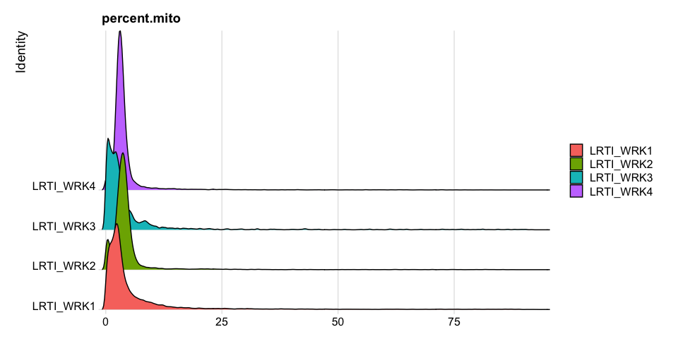<!-- -->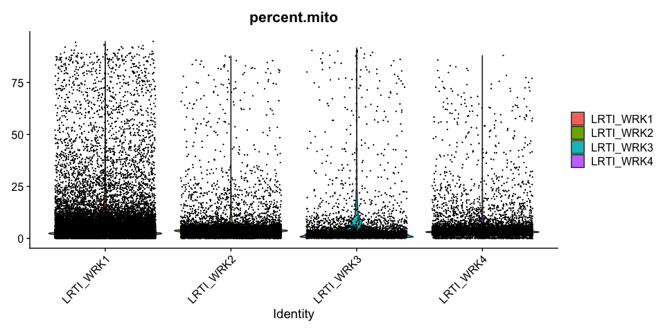<!-- -->

#### Percentage of Ribosomal (protein) per cell 

<table class="table table-striped" style="margin-left: auto; margin-right: auto;">
<caption>Ribosomal percentage distribution by sample</caption>
 <thead>
  <tr>
   <th style="text-align:left;">  </th>
   <th style="text-align:right;"> LRTI_WRK1 </th>
   <th style="text-align:right;"> LRTI_WRK2 </th>
   <th style="text-align:right;"> LRTI_WRK3 </th>
   <th style="text-align:right;"> LRTI_WRK4 </th>
  </tr>
 </thead>
<tbody>
  <tr>
   <td style="text-align:left;"> 0% </td>
   <td style="text-align:right;"> 0.000 </td>
   <td style="text-align:right;"> 0.000 </td>
   <td style="text-align:right;"> 0.000 </td>
   <td style="text-align:right;"> 0.144 </td>
  </tr>
  <tr>
   <td style="text-align:left;"> 5% </td>
   <td style="text-align:right;"> 0.882 </td>
   <td style="text-align:right;"> 0.611 </td>
   <td style="text-align:right;"> 0.192 </td>
   <td style="text-align:right;"> 1.498 </td>
  </tr>
  <tr>
   <td style="text-align:left;"> 10% </td>
   <td style="text-align:right;"> 1.907 </td>
   <td style="text-align:right;"> 1.135 </td>
   <td style="text-align:right;"> 0.301 </td>
   <td style="text-align:right;"> 5.342 </td>
  </tr>
  <tr>
   <td style="text-align:left;"> 15% </td>
   <td style="text-align:right;"> 2.961 </td>
   <td style="text-align:right;"> 3.782 </td>
   <td style="text-align:right;"> 0.393 </td>
   <td style="text-align:right;"> 6.252 </td>
  </tr>
  <tr>
   <td style="text-align:left;"> 20% </td>
   <td style="text-align:right;"> 3.648 </td>
   <td style="text-align:right;"> 5.220 </td>
   <td style="text-align:right;"> 0.502 </td>
   <td style="text-align:right;"> 6.804 </td>
  </tr>
  <tr>
   <td style="text-align:left;"> 25% </td>
   <td style="text-align:right;"> 4.128 </td>
   <td style="text-align:right;"> 5.671 </td>
   <td style="text-align:right;"> 0.639 </td>
   <td style="text-align:right;"> 7.213 </td>
  </tr>
  <tr>
   <td style="text-align:left;"> 30% </td>
   <td style="text-align:right;"> 4.556 </td>
   <td style="text-align:right;"> 6.018 </td>
   <td style="text-align:right;"> 0.833 </td>
   <td style="text-align:right;"> 7.565 </td>
  </tr>
  <tr>
   <td style="text-align:left;"> 35% </td>
   <td style="text-align:right;"> 4.923 </td>
   <td style="text-align:right;"> 6.312 </td>
   <td style="text-align:right;"> 1.142 </td>
   <td style="text-align:right;"> 7.902 </td>
  </tr>
  <tr>
   <td style="text-align:left;"> 40% </td>
   <td style="text-align:right;"> 5.263 </td>
   <td style="text-align:right;"> 6.581 </td>
   <td style="text-align:right;"> 1.899 </td>
   <td style="text-align:right;"> 8.217 </td>
  </tr>
  <tr>
   <td style="text-align:left;"> 45% </td>
   <td style="text-align:right;"> 5.600 </td>
   <td style="text-align:right;"> 6.836 </td>
   <td style="text-align:right;"> 3.208 </td>
   <td style="text-align:right;"> 8.521 </td>
  </tr>
  <tr>
   <td style="text-align:left;"> 50% </td>
   <td style="text-align:right;"> 5.974 </td>
   <td style="text-align:right;"> 7.089 </td>
   <td style="text-align:right;"> 4.098 </td>
   <td style="text-align:right;"> 8.824 </td>
  </tr>
  <tr>
   <td style="text-align:left;"> 55% </td>
   <td style="text-align:right;"> 6.364 </td>
   <td style="text-align:right;"> 7.354 </td>
   <td style="text-align:right;"> 4.817 </td>
   <td style="text-align:right;"> 9.118 </td>
  </tr>
  <tr>
   <td style="text-align:left;"> 60% </td>
   <td style="text-align:right;"> 6.806 </td>
   <td style="text-align:right;"> 7.620 </td>
   <td style="text-align:right;"> 5.400 </td>
   <td style="text-align:right;"> 9.440 </td>
  </tr>
  <tr>
   <td style="text-align:left;"> 65% </td>
   <td style="text-align:right;"> 7.345 </td>
   <td style="text-align:right;"> 7.912 </td>
   <td style="text-align:right;"> 6.147 </td>
   <td style="text-align:right;"> 9.783 </td>
  </tr>
  <tr>
   <td style="text-align:left;"> 70% </td>
   <td style="text-align:right;"> 8.078 </td>
   <td style="text-align:right;"> 8.245 </td>
   <td style="text-align:right;"> 6.969 </td>
   <td style="text-align:right;"> 10.176 </td>
  </tr>
  <tr>
   <td style="text-align:left;"> 75% </td>
   <td style="text-align:right;"> 9.089 </td>
   <td style="text-align:right;"> 8.659 </td>
   <td style="text-align:right;"> 7.845 </td>
   <td style="text-align:right;"> 10.635 </td>
  </tr>
  <tr>
   <td style="text-align:left;"> 80% </td>
   <td style="text-align:right;"> 10.385 </td>
   <td style="text-align:right;"> 9.250 </td>
   <td style="text-align:right;"> 8.859 </td>
   <td style="text-align:right;"> 11.157 </td>
  </tr>
  <tr>
   <td style="text-align:left;"> 85% </td>
   <td style="text-align:right;"> 11.861 </td>
   <td style="text-align:right;"> 10.313 </td>
   <td style="text-align:right;"> 10.125 </td>
   <td style="text-align:right;"> 11.868 </td>
  </tr>
  <tr>
   <td style="text-align:left;"> 90% </td>
   <td style="text-align:right;"> 13.561 </td>
   <td style="text-align:right;"> 12.554 </td>
   <td style="text-align:right;"> 11.672 </td>
   <td style="text-align:right;"> 13.130 </td>
  </tr>
  <tr>
   <td style="text-align:left;"> 95% </td>
   <td style="text-align:right;"> 15.965 </td>
   <td style="text-align:right;"> 16.720 </td>
   <td style="text-align:right;"> 14.853 </td>
   <td style="text-align:right;"> 16.216 </td>
  </tr>
  <tr>
   <td style="text-align:left;"> 100% </td>
   <td style="text-align:right;"> 45.035 </td>
   <td style="text-align:right;"> 38.339 </td>
   <td style="text-align:right;"> 38.631 </td>
   <td style="text-align:right;"> 52.027 </td>
  </tr>
</tbody>
</table>

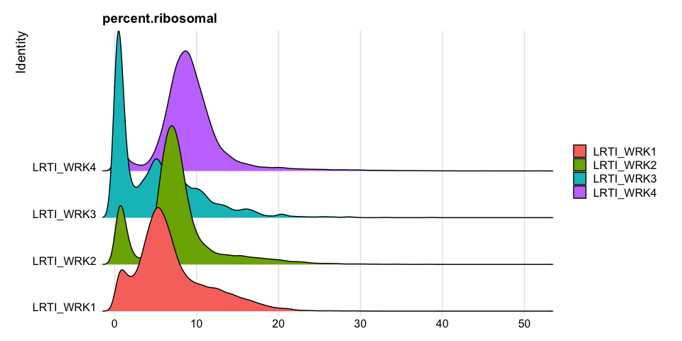<!-- -->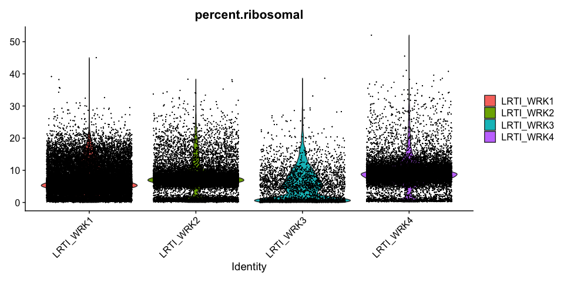<!-- -->

#### Modifying Seurat plots

Modifying the ggplot objects produced by a Seurat plotting function works best on individual panels. Therefore, to recreate the function above with modifications, we can use `lapply` to create a list of plots. In some cases it may be more appropriate to create the plots individually so that different modifications can be applied to each plot.


``` r
VlnPlot(experiment.aggregate, features = "nCount_RNA", pt.size = 0.01) + 
  scale_y_continuous(trans = "log10") +
  scale_fill_viridis_d(option = "mako") +
  ggtitle("log10(nCount_RNA)")
```

<!-- -->

These can later be stitched together with another library, like patchwork, or cowplot.

### Custom plots
The Seurat built-in functions are useful and easy to interact with, but sometimes you may wish to visualize something for which a plotting function does not already exist. For example, we might want to see how many cells are expressing each gene over some UMI threshold.

The code below produces a ranked plot similar to the barcode inflection plots from the last section. On the x-axis are the genes arranged from least ubiquitously expressed to most. In a single cell dataset, many genes are expessed in a relatively small number of cells, or not at all. The y-axis displays the number of cells in which each gene is expressed.

**Note: This function is SLOW. You may want to skip this code block or run it while you take a break for a few minutes.**

``` r
plot(sort(Matrix::rowSums(GetAssayData(experiment.aggregate) >= 3)) , xlab="gene rank", ylab="number of cells", main="Cells per genes (reads/gene >= 3 )")
```

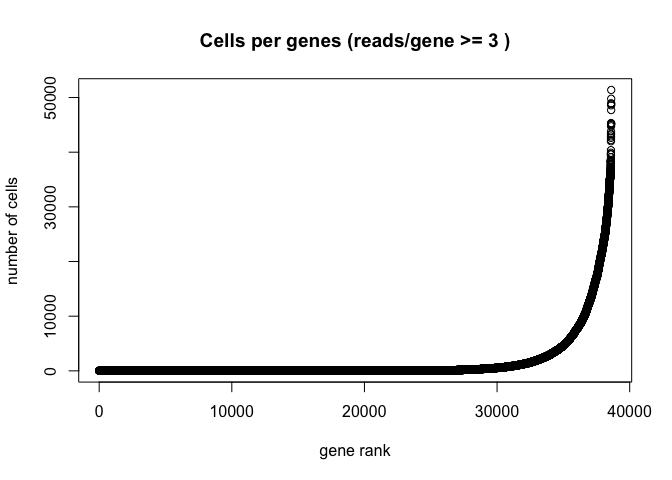<!-- -->

### Scatter plots
Scatter plots allow us to visualize the relationships between the metadata variables.

Gene Plot, scatter plot of gene expression across cells, (colored by sample)
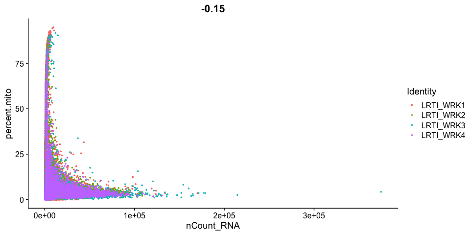<!-- -->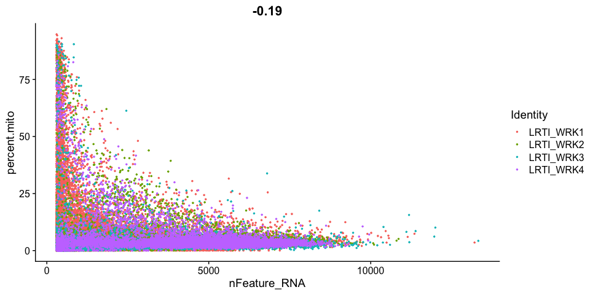<!-- -->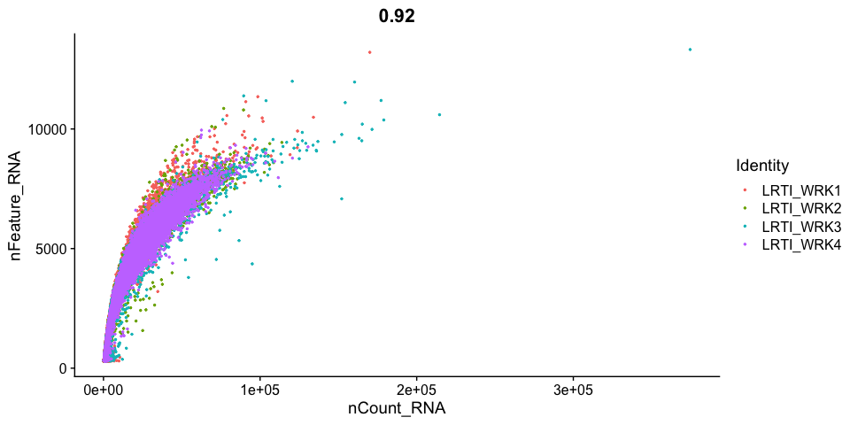<!-- -->

### Cell filtering

We use the information above to filter out cells. Here we choose those that have percent mitochondrial genes max of 10% and unique UMI counts under 50,000 or greater than 500. Further requiring the number of features persent per cell to be 1000 genes.

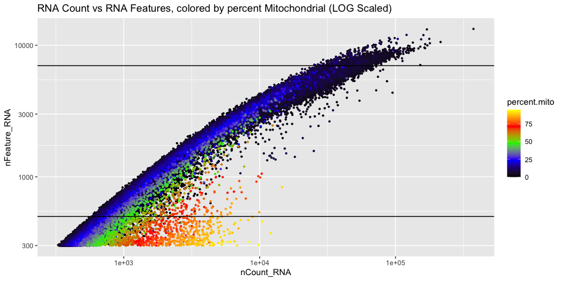<!-- -->

## Cell Complexity

The standard way of calculating this is log10(genes)/log10(counts) however this gives absolute values which are difficult to judge. A possibly better approach is to fit a line through the cloud and then calculate the difference from the observed value to the expected.


```
## 
## Call:
## lm(formula = log10(qc.metrics$nFeature_RNA) ~ log10(qc.metrics$nCount_RNA))
## 
## Coefficients:
##                  (Intercept)  log10(qc.metrics$nCount_RNA)  
##                       0.8111                        0.6615
```

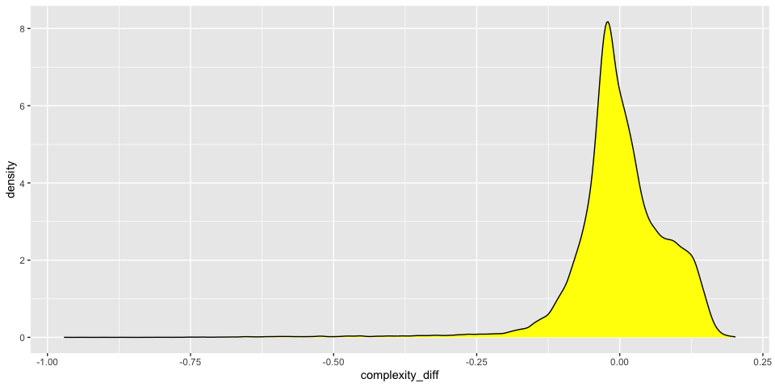<!-- -->
And we can add the information to the scatter plot

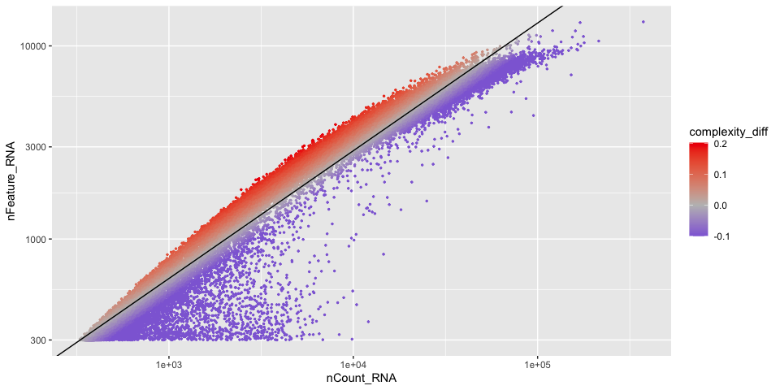<!-- -->
  
  
### Histograms of metadata

Histograms can also be useful to look at the distribution over all the cells

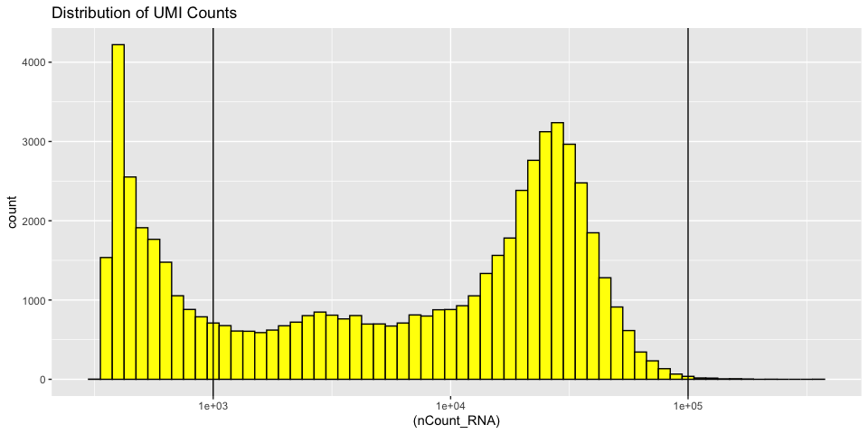<!-- -->

Displaying the number of genes per cell

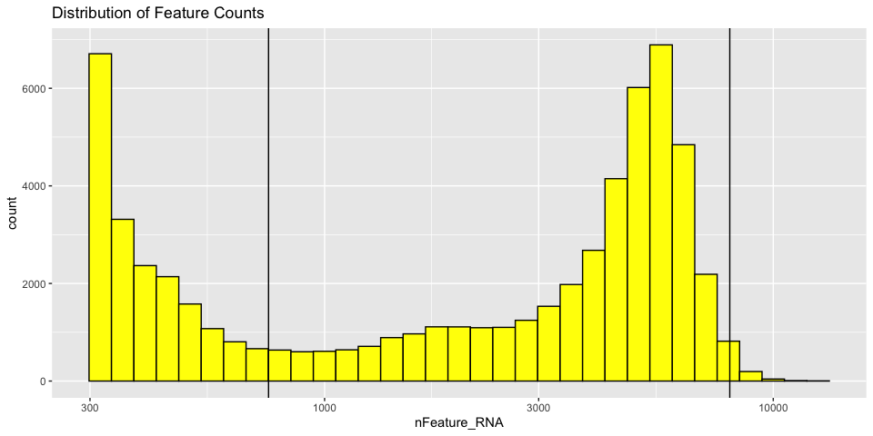<!-- -->


With Mitochondrial expression

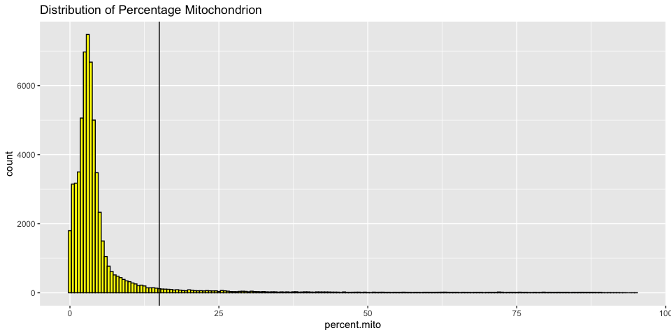<!-- -->


## Cell filtering
The goal of cell filtering is to remove cells with anomolous expression profiles, typically low UMI cells, which may correspond to low-quality cells or background barcodes. It may also be appropriate to remove outlier cells with extremely high UMI counts.
In this case, the proposed cut-offs on the high end of the distributions are quite conservative, in part to reduce the size of the object and speed up analysis during the workshop.


These filters can be put in place with the `subset` function.

#### Prefiltered data

<table class="table table-striped" style="margin-left: auto; margin-right: auto;">
<caption>Cell countse per sample</caption>
 <thead>
  <tr>
   <th style="text-align:left;"> Sample </th>
   <th style="text-align:right;"> Number of Cells </th>
  </tr>
 </thead>
<tbody>
  <tr>
   <td style="text-align:left;"> LRTI_WRK1 </td>
   <td style="text-align:right;"> 28124 </td>
  </tr>
  <tr>
   <td style="text-align:left;"> LRTI_WRK2 </td>
   <td style="text-align:right;"> 14933 </td>
  </tr>
  <tr>
   <td style="text-align:left;"> LRTI_WRK3 </td>
   <td style="text-align:right;"> 3343 </td>
  </tr>
  <tr>
   <td style="text-align:left;"> LRTI_WRK4 </td>
   <td style="text-align:right;"> 14297 </td>
  </tr>
</tbody>
</table>


#### Post filtered data

<table class="table table-striped" style="margin-left: auto; margin-right: auto;">
<caption>Cell countse per sample</caption>
 <thead>
  <tr>
   <th style="text-align:left;"> Sample </th>
   <th style="text-align:right;"> Number of Cells </th>
  </tr>
 </thead>
<tbody>
  <tr>
   <td style="text-align:left;"> LRTI_WRK1 </td>
   <td style="text-align:right;"> 12372 </td>
  </tr>
  <tr>
   <td style="text-align:left;"> LRTI_WRK2 </td>
   <td style="text-align:right;"> 12480 </td>
  </tr>
  <tr>
   <td style="text-align:left;"> LRTI_WRK3 </td>
   <td style="text-align:right;"> 2084 </td>
  </tr>
  <tr>
   <td style="text-align:left;"> LRTI_WRK4 </td>
   <td style="text-align:right;"> 13116 </td>
  </tr>
</tbody>
</table>

**Play with the filtering parameters, and see how the results change. Is there a set of parameters you feel is more appropriate? Why?**

## Feature filtering

When creating the base Seurat object, we had the opportunity filter out some genes using the "min.cells" argument. At the time, we set the min feature to keep a cell to 300. Since we didn't filter out any features then (set to 0), we can apply a filter at this point. If we had filtered when the object was created, this would be an opportunity to be more aggressive. The custom code below provides a function that filters genes requiring a min.umi in at least min.cells, or takes a user-provided list of genes.


``` r
# define function
FilterGenes <- function(object, min.umi = NA, min.cells = NA, genes = NULL) {
  genes.use = NA
  if (!is.null(genes)) {
    genes.use = intersect(rownames(object), genes)
    } else if (min.cells & min.umi) {
      num.cells = Matrix::rowSums(GetAssayData(object) >= min.umi)
      genes.use = names(num.cells[which(num.cells >= min.cells)])
    }
  object = object[genes.use,]
  object = LogSeuratCommand(object = object)
  return(object)
}
# apply filter
experiment.filter <- FilterGenes(object = experiment.aggregate.filtered, min.umi = 1, min.cells = 2)
# filtering results
experiment.filter
```

```
## An object of class Seurat 
## 31828 features across 40052 samples within 1 assay 
## Active assay: RNA (31828 features, 0 variable features)
##  1 layer present: counts
```
## We are going to choose to not filter the genes at this time, but know you can

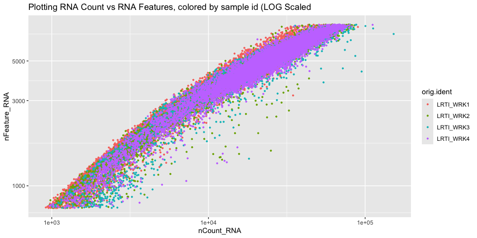<!-- -->

## Prepare for the next section

#### Save object

``` r
saveRDS(experiment.aggregate.filtered, file="scRNA_workshop-02.rds")
```

#### Download Rmd

``` r
download.file("https://raw.githubusercontent.com/ucsf-cat-bioinformatics/2024-08-SCRNA-Seq-Analysis/main/data_analysis/03-normalize_scale.Rmd", "03-normalize_scale.Rmd")
```

#### Session Information

``` r
sessionInfo()
```

```
## R version 4.4.1 (2024-06-14)
## Platform: aarch64-apple-darwin20
## Running under: macOS Sonoma 14.6.1
## 
## Matrix products: default
## BLAS:   /Library/Frameworks/R.framework/Versions/4.4-arm64/Resources/lib/libRblas.0.dylib 
## LAPACK: /Library/Frameworks/R.framework/Versions/4.4-arm64/Resources/lib/libRlapack.dylib;  LAPACK version 3.12.0
## 
## locale:
## [1] en_US.UTF-8/en_US.UTF-8/en_US.UTF-8/C/en_US.UTF-8/en_US.UTF-8
## 
## time zone: America/Los_Angeles
## tzcode source: internal
## 
## attached base packages:
## [1] stats     graphics  grDevices utils     datasets  methods   base     
## 
## other attached packages:
## [1] kableExtra_1.4.0   dplyr_1.1.4        tidyr_1.3.1        ggplot2_3.5.1     
## [5] Seurat_5.1.0       SeuratObject_5.0.2 sp_2.1-4          
## 
## loaded via a namespace (and not attached):
##   [1] deldir_2.0-4           pbapply_1.7-2          gridExtra_2.3         
##   [4] rlang_1.1.4            magrittr_2.0.3         RcppAnnoy_0.0.22      
##   [7] spatstat.geom_3.3-2    matrixStats_1.3.0      ggridges_0.5.6        
##  [10] compiler_4.4.1         systemfonts_1.1.0      png_0.1-8             
##  [13] vctrs_0.6.5            reshape2_1.4.4         stringr_1.5.1         
##  [16] pkgconfig_2.0.3        fastmap_1.2.0          labeling_0.4.3        
##  [19] utf8_1.2.4             promises_1.3.0         rmarkdown_2.28        
##  [22] purrr_1.0.2            xfun_0.47              cachem_1.1.0          
##  [25] jsonlite_1.8.8         goftest_1.2-3          highr_0.11            
##  [28] later_1.3.2            spatstat.utils_3.1-0   irlba_2.3.5.1         
##  [31] parallel_4.4.1         cluster_2.1.6          R6_2.5.1              
##  [34] ica_1.0-3              spatstat.data_3.1-2    bslib_0.8.0           
##  [37] stringi_1.8.4          RColorBrewer_1.1-3     reticulate_1.38.0     
##  [40] spatstat.univar_3.0-0  parallelly_1.38.0      lmtest_0.9-40         
##  [43] jquerylib_0.1.4        scattermore_1.2        Rcpp_1.0.13           
##  [46] knitr_1.48             tensor_1.5             future.apply_1.11.2   
##  [49] zoo_1.8-12             sctransform_0.4.1      httpuv_1.6.15         
##  [52] Matrix_1.7-0           splines_4.4.1          igraph_2.0.3          
##  [55] tidyselect_1.2.1       abind_1.4-5            rstudioapi_0.16.0     
##  [58] yaml_2.3.10            spatstat.random_3.3-1  codetools_0.2-20      
##  [61] miniUI_0.1.1.1         spatstat.explore_3.3-2 listenv_0.9.1         
##  [64] lattice_0.22-6         tibble_3.2.1           plyr_1.8.9            
##  [67] withr_3.0.1            shiny_1.9.1            ROCR_1.0-11           
##  [70] evaluate_0.24.0        Rtsne_0.17             future_1.34.0         
##  [73] fastDummies_1.7.4      survival_3.7-0         polyclip_1.10-7       
##  [76] xml2_1.3.6             fitdistrplus_1.2-1     pillar_1.9.0          
##  [79] KernSmooth_2.23-24     plotly_4.10.4          generics_0.1.3        
##  [82] RcppHNSW_0.6.0         munsell_0.5.1          scales_1.3.0          
##  [85] globals_0.16.3         xtable_1.8-4           glue_1.7.0            
##  [88] lazyeval_0.2.2         tools_4.4.1            data.table_1.15.4     
##  [91] RSpectra_0.16-2        RANN_2.6.2             leiden_0.4.3.1        
##  [94] dotCall64_1.1-1        cowplot_1.1.3          grid_4.4.1            
##  [97] colorspace_2.1-1       nlme_3.1-166           patchwork_1.2.0       
## [100] cli_3.6.3              spatstat.sparse_3.1-0  spam_2.10-0           
## [103] fansi_1.0.6            viridisLite_0.4.2      svglite_2.1.3         
## [106] uwot_0.2.2             gtable_0.3.5           sass_0.4.9            
## [109] digest_0.6.37          progressr_0.14.0       ggrepel_0.9.5         
## [112] farver_2.1.2           htmlwidgets_1.6.4      htmltools_0.5.8.1     
## [115] lifecycle_1.0.4        httr_1.4.7             mime_0.12             
## [118] MASS_7.3-61
```
