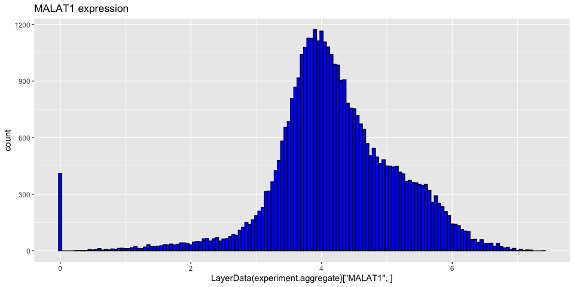
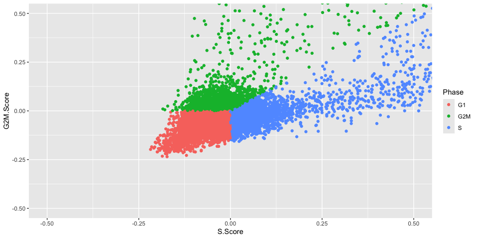
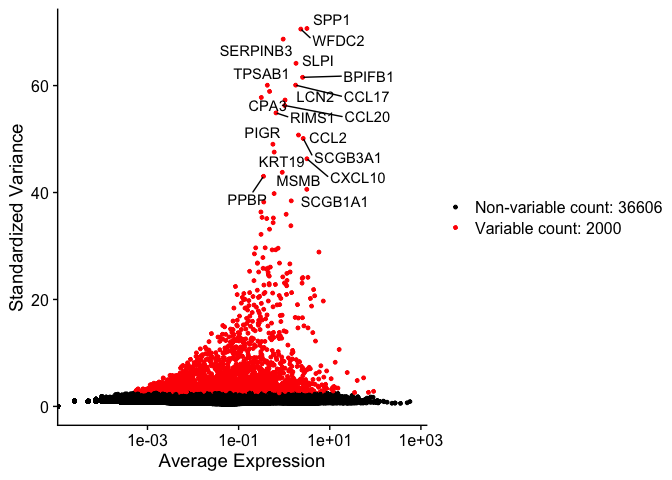
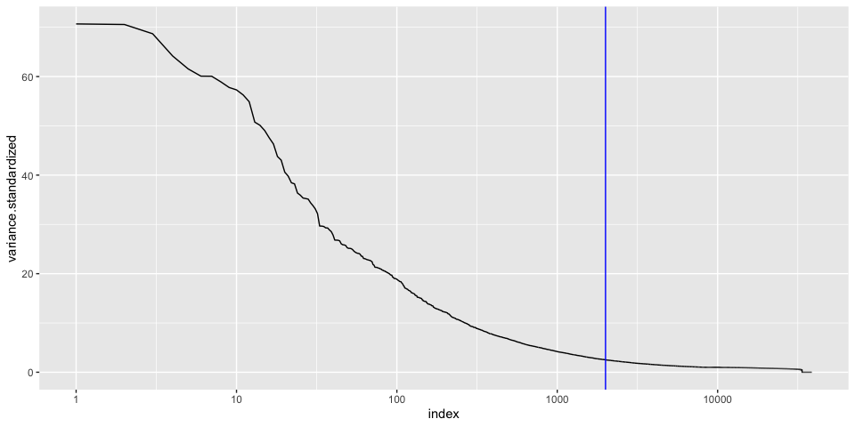
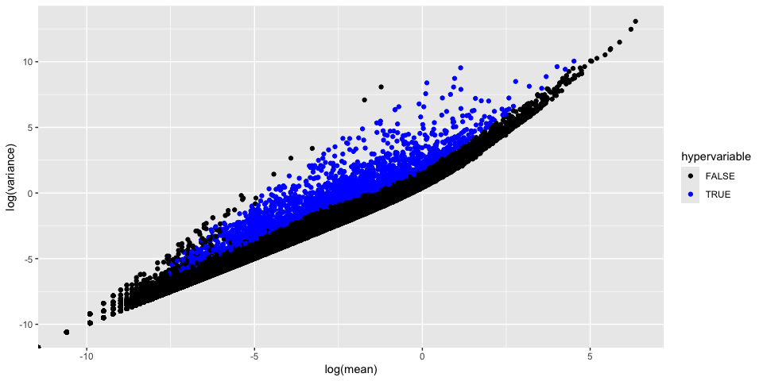

# Introduction to Single Cell RNA-Seq Part 3: Normalize and scale


## Set up workspace
First, we need to load the required libraries.

``` r
library(Seurat)
library(kableExtra)
library(ggplot2)
library(dplyr)
```

We will be continuing the work from Part 1 and so need to load in the RDS file

``` r
experiment.aggregate <- readRDS("scRNA_workshop-02.rds")
experiment.aggregate
```

```
## An object of class Seurat 
## 38606 features across 40052 samples within 1 assay 
## Active assay: RNA (38606 features, 0 variable features)
##  1 layer present: counts
```

Lets go ahead and set that common seed for everyone

``` r
set.seed(12345)
```

## Normalize the data

After filtering, the next step is to normalize the data. We employ a global-scaling normalization method, LogNormalize, that normalizes the gene expression measurements for each cell by the total expression, multiplies this by a scale factor (10,000 by default), and then log-transforms the data.


``` r
?NormalizeData
```


``` r
experiment.aggregate <- NormalizeData(
  object = experiment.aggregate,
  normalization.method = "LogNormalize",
  scale.factor = 10000)
```


``` r
experiment.aggregate
```

```
## An object of class Seurat 
## 38606 features across 40052 samples within 1 assay 
## Active assay: RNA (38606 features, 0 variable features)
##  2 layers present: counts, data
```

The function produces a new layer in the object called "data". We can now access the normalised data using LayerData. We can use this to show that we can get a list of the most highly expressed genes overall.


``` r
norm.expression <- LayerData(experiment.aggregate,layer="data")

mean.expression <- apply(norm.expression, 1, mean)

names(mean.expression) <- rownames(experiment.aggregate)

mean.expression <- sort(mean.expression, decreasing = TRUE)

head(mean.expression, n=50)
```

```
##     FTH1   MT-CO1      FTL     CD74      B2M   TMSB4X   MALAT1   MT-CO2 
## 4.646231 4.539242 4.525198 4.489474 4.458964 4.284744 4.198105 3.860866 
##     ACTB   EEF1A1  HLA-DRA     TPT1   MT-CO3    HLA-B      VIM    HLA-A 
## 3.855886 3.711285 3.653941 3.587522 3.534209 3.503641 3.407929 3.285413 
## HLA-DRB1   TMSB10  S100A11    RPLP1   MT-CYB    IFI30    HLA-C    RPL28 
## 3.276857 3.240642 3.203091 3.174771 3.137407 3.085733 3.068303 3.030152 
##    RPL41    RPL10     PFN1  MT-ND4L  MT-ATP6   TYROBP HLA-DPA1   MT-ND4 
## 2.953827 2.952570 2.910644 2.886496 2.880725 2.875505 2.870495 2.859882 
##   S100A6   MT-ND5     MYL6   RPL13A   MT-ND2     RPS8    RPL13     PSAP 
## 2.846236 2.844457 2.785106 2.785023 2.764556 2.721428 2.716863 2.712893 
##    RPS19   MT-ND1      LYZ    RPS12     CST3     CTSD     RPS2    RPLP2 
## 2.709430 2.688671 2.657034 2.656320 2.655618 2.648870 2.647233 2.607146 
## HLA-DPB1 HLA-DRB5 
## 2.599841 2.597642
```

We see a number of Mitochondrial genes that are highly expressed as well as some of our Ribosomal products.

<!-- -->
**Explore a couple more of these genes**

## Cell cycle assignment
Cell cycle phase can be a significant source of variation in single cell and single nucleus experiments. There are a number of automated cell cycle stage detection methods available for single cell data. For this workshop, we will be using the built-in Seurat cell cycle function, `CellCycleScoring`. This tool compares gene expression in each cell to a list of cell cycle marker genes and scores each barcode based on marker expression. The phase with the highest score is selected for each barcode. Seurat includes a list of cell cycle genes in human single cell data.

Seurat comes with the human gene lists needed for Cell Cycle determination.


``` r
cc.genes.updated.2019
```

```
## $s.genes
##  [1] "MCM5"     "PCNA"     "TYMS"     "FEN1"     "MCM7"     "MCM4"    
##  [7] "RRM1"     "UNG"      "GINS2"    "MCM6"     "CDCA7"    "DTL"     
## [13] "PRIM1"    "UHRF1"    "CENPU"    "HELLS"    "RFC2"     "POLR1B"  
## [19] "NASP"     "RAD51AP1" "GMNN"     "WDR76"    "SLBP"     "CCNE2"   
## [25] "UBR7"     "POLD3"    "MSH2"     "ATAD2"    "RAD51"    "RRM2"    
## [31] "CDC45"    "CDC6"     "EXO1"     "TIPIN"    "DSCC1"    "BLM"     
## [37] "CASP8AP2" "USP1"     "CLSPN"    "POLA1"    "CHAF1B"   "MRPL36"  
## [43] "E2F8"    
## 
## $g2m.genes
##  [1] "HMGB2"   "CDK1"    "NUSAP1"  "UBE2C"   "BIRC5"   "TPX2"    "TOP2A"  
##  [8] "NDC80"   "CKS2"    "NUF2"    "CKS1B"   "MKI67"   "TMPO"    "CENPF"  
## [15] "TACC3"   "PIMREG"  "SMC4"    "CCNB2"   "CKAP2L"  "CKAP2"   "AURKB"  
## [22] "BUB1"    "KIF11"   "ANP32E"  "TUBB4B"  "GTSE1"   "KIF20B"  "HJURP"  
## [29] "CDCA3"   "JPT1"    "CDC20"   "TTK"     "CDC25C"  "KIF2C"   "RANGAP1"
## [36] "NCAPD2"  "DLGAP5"  "CDCA2"   "CDCA8"   "ECT2"    "KIF23"   "HMMR"   
## [43] "AURKA"   "PSRC1"   "ANLN"    "LBR"     "CKAP5"   "CENPE"   "CTCF"   
## [50] "NEK2"    "G2E3"    "GAS2L3"  "CBX5"    "CENPA"
```

For other species, a user-provided gene list may be substituted, or the orthologs of the human gene list used instead.
**Do not run the code below for human experiments!**


``` r
# mouse code DO NOT RUN for human data
library(biomaRt)
convertHumanGeneList <- function(x){
  require("biomaRt")
  human = useEnsembl("ensembl",
                     dataset = "hsapiens_gene_ensembl",
                     mirror = "uswest")
  mouse = useEnsembl("ensembl",
                     dataset = "mmusculus_gene_ensembl",
                     mirror = "uswest")
  genes = getLDS(attributes = c("hgnc_symbol"),
                 filters = "hgnc_symbol",
                 values = x ,
                 mart = human,
                 attributesL = c("mgi_symbol"),
                 martL = mouse,
                 uniqueRows=T)
  humanx = unique(genes[, 2])
  print(head(humanx)) # print first 6 genes found to the screen
  return(humanx)
}
# convert lists to mouse orthologs
s.genes <- convertHumanGeneList(cc.genes.updated.2019$s.genes)
g2m.genes <- convertHumanGeneList(cc.genes.updated.2019$g2m.genes)
```

Once an appropriate gene list has been identified, the `CellCycleScoring` function can be run.

``` r
experiment.aggregate <- CellCycleScoring(experiment.aggregate,
                                         s.features = cc.genes.updated.2019$s.genes,
                                         g2m.features = cc.genes.updated.2019$g2m.genes,
                                         set.ident = TRUE)

table(experiment.aggregate[["Phase"]]) %>%
  kable(caption = "Number of Cells in each Cell Cycle Stage",
        col.names = c("Stage", "Count"),
        align = "c") %>%
  kable_styling()
```

<table class="table" style="margin-left: auto; margin-right: auto;">
<caption>Number of Cells in each Cell Cycle Stage</caption>
 <thead>
  <tr>
   <th style="text-align:center;"> Stage </th>
   <th style="text-align:center;"> Count </th>
  </tr>
 </thead>
<tbody>
  <tr>
   <td style="text-align:center;"> G1 </td>
   <td style="text-align:center;"> 24873 </td>
  </tr>
  <tr>
   <td style="text-align:center;"> G2M </td>
   <td style="text-align:center;"> 4501 </td>
  </tr>
  <tr>
   <td style="text-align:center;"> S </td>
   <td style="text-align:center;"> 10678 </td>
  </tr>
</tbody>
</table>

We can visualize how the algorithm assigns state based on the computed S.Score and G2M.Score

<!-- -->

Because the "set.ident" argument was set to TRUE (this is also the default behavior), the active identity of the Seurat object was changed to the phase. To return the active identity to the sample identity, use the `Idents` function.


``` r
table(Idents(experiment.aggregate))
```

```
## 
##    G1     S   G2M 
## 24873 10678  4501
```

``` r
Idents(experiment.aggregate) <- "orig.ident"
table(Idents(experiment.aggregate))
```

```
## 
## LRTI_WRK1 LRTI_WRK2 LRTI_WRK3 LRTI_WRK4 
##     12372     12480      2084     13116
```

## Identify variable genes

The function FindVariableFeatures identifies the most highly variable genes (default 2000 genes) by fitting a line to the relationship of log(variance) and log(mean) using loess smoothing, uses this information to standardize the data, then calculates the variance of the standardized data.  This helps avoid selecting genes that only appear variable due to their expression level.


``` r
?FindVariableFeatures
```


``` r
experiment.aggregate <- FindVariableFeatures(
  object = experiment.aggregate,
  selection.method = "vst") ## vst having issues??

length(VariableFeatures(experiment.aggregate))
```

```
## [1] 2000
```
The function places data in an object called HVFInfo, we can extract and look at the results of find variable features for each gene.


```
##               mean    variance variance.expected variance.standardized
## SPP1     3.1527514  2686.06256        13.3812444              70.68009
## WFDC2    2.3125936  1828.29703         8.0168136              70.56587
## SERPINB3 0.9510137   328.98015         2.0923136              68.68482
## SLPI     1.8165635  1393.96303         5.4465838              64.16529
## BPIFB1   2.5344552  3206.84176         9.3129384              61.54649
## CCL17    1.7835314   377.07781         5.2919254              60.07977
## TPSAB1   0.4262459   112.10639         0.7843354              60.06400
## PTGDS    0.4777789    98.86088         0.8900317              58.90872
## CPA3     0.3148157    56.25267         0.5730767              57.78090
## LCN2     1.0441676   712.20201         2.3810364              57.29496
## CCL20    1.0298362   136.89489         2.3354899              56.27489
## RIMS1    0.6606162    87.75036         1.3035991              54.89394
## CCL2     2.0587486   499.79263         6.6439926              50.74984
## SCGB3A1  2.6130031  6191.75650         9.7929258              50.11783
## PIGR     0.5649905    78.83029         1.0793266              49.02960
## KRT19    0.6037152    81.37270         1.1681873              47.55942
## CXCL10   3.1525267   624.45735        13.3796467              46.31380
## MSMB     0.9065215   886.44963         1.9604775              43.78314
## PPBP     0.3517677    81.13333         0.6405779              43.03506
## SCGB1A1  3.1295316 13863.77504        13.2166073              40.59522
```

We can plot this data, while marking the top 20

<!-- -->

<!-- -->

Goes mostly flat at around 100, so we will keep our list of variable genes




**How do the results change if you use selection.method = "dispersion" or selection.method = "mean.var.plot"?**

FindVariableFeatures isn't the only way to set the "variable features" of a Seurat object. Another reasonable approach is to select a set of "minimally expressed" genes.

``` r
min.value <- 2
min.cells <- 10

num.cells <- Matrix::rowSums(GetAssayData(experiment.aggregate, slot = "count") > min.value)
genes.use <- names(num.cells[which(num.cells >= min.cells)])
length(genes.use)
```

```
## [1] 15841
```

``` r
VariableFeatures(experiment.aggregate) <- genes.use
```

## Prepare for the next section

#### Save object

``` r
saveRDS(experiment.aggregate, file = "scRNA_workshop-03.rds")
```

#### Download Rmd

``` r
download.file("https://raw.githubusercontent.com/ucsf-cat-bioinformatics/2024-08-SCRNA-Seq-Analysis/main/data_analysis/04-dimensionality_reduction.Rmd", "04-dimensionality_reduction.Rmd")
```

#### Session Information

``` r
sessionInfo()
```

```
## R version 4.4.1 (2024-06-14)
## Platform: aarch64-apple-darwin20
## Running under: macOS Sonoma 14.6.1
## 
## Matrix products: default
## BLAS:   /Library/Frameworks/R.framework/Versions/4.4-arm64/Resources/lib/libRblas.0.dylib 
## LAPACK: /Library/Frameworks/R.framework/Versions/4.4-arm64/Resources/lib/libRlapack.dylib;  LAPACK version 3.12.0
## 
## locale:
## [1] en_US.UTF-8/en_US.UTF-8/en_US.UTF-8/C/en_US.UTF-8/en_US.UTF-8
## 
## time zone: America/Los_Angeles
## tzcode source: internal
## 
## attached base packages:
## [1] stats     graphics  grDevices utils     datasets  methods   base     
## 
## other attached packages:
## [1] dplyr_1.1.4        ggplot2_3.5.1      kableExtra_1.4.0   Seurat_5.1.0      
## [5] SeuratObject_5.0.2 sp_2.1-4          
## 
## loaded via a namespace (and not attached):
##   [1] deldir_2.0-4           pbapply_1.7-2          gridExtra_2.3         
##   [4] rlang_1.1.4            magrittr_2.0.3         RcppAnnoy_0.0.22      
##   [7] spatstat.geom_3.3-2    matrixStats_1.3.0      ggridges_0.5.6        
##  [10] compiler_4.4.1         systemfonts_1.1.0      png_0.1-8             
##  [13] vctrs_0.6.5            reshape2_1.4.4         stringr_1.5.1         
##  [16] pkgconfig_2.0.3        fastmap_1.2.0          labeling_0.4.3        
##  [19] utf8_1.2.4             promises_1.3.0         rmarkdown_2.28        
##  [22] purrr_1.0.2            xfun_0.47              cachem_1.1.0          
##  [25] jsonlite_1.8.8         goftest_1.2-3          highr_0.11            
##  [28] later_1.3.2            spatstat.utils_3.1-0   irlba_2.3.5.1         
##  [31] parallel_4.4.1         cluster_2.1.6          R6_2.5.1              
##  [34] ica_1.0-3              spatstat.data_3.1-2    bslib_0.8.0           
##  [37] stringi_1.8.4          RColorBrewer_1.1-3     reticulate_1.38.0     
##  [40] spatstat.univar_3.0-0  parallelly_1.38.0      lmtest_0.9-40         
##  [43] jquerylib_0.1.4        scattermore_1.2        Rcpp_1.0.13           
##  [46] knitr_1.48             tensor_1.5             future.apply_1.11.2   
##  [49] zoo_1.8-12             sctransform_0.4.1      httpuv_1.6.15         
##  [52] Matrix_1.7-0           splines_4.4.1          igraph_2.0.3          
##  [55] tidyselect_1.2.1       abind_1.4-5            rstudioapi_0.16.0     
##  [58] yaml_2.3.10            spatstat.random_3.3-1  codetools_0.2-20      
##  [61] miniUI_0.1.1.1         spatstat.explore_3.3-2 listenv_0.9.1         
##  [64] lattice_0.22-6         tibble_3.2.1           plyr_1.8.9            
##  [67] withr_3.0.1            shiny_1.9.1            ROCR_1.0-11           
##  [70] evaluate_0.24.0        Rtsne_0.17             future_1.34.0         
##  [73] fastDummies_1.7.4      survival_3.7-0         polyclip_1.10-7       
##  [76] xml2_1.3.6             fitdistrplus_1.2-1     pillar_1.9.0          
##  [79] KernSmooth_2.23-24     plotly_4.10.4          generics_0.1.3        
##  [82] RcppHNSW_0.6.0         munsell_0.5.1          scales_1.3.0          
##  [85] globals_0.16.3         xtable_1.8-4           glue_1.7.0            
##  [88] lazyeval_0.2.2         tools_4.4.1            data.table_1.15.4     
##  [91] RSpectra_0.16-2        RANN_2.6.2             leiden_0.4.3.1        
##  [94] dotCall64_1.1-1        cowplot_1.1.3          grid_4.4.1            
##  [97] tidyr_1.3.1            colorspace_2.1-1       nlme_3.1-166          
## [100] patchwork_1.2.0        cli_3.6.3              spatstat.sparse_3.1-0 
## [103] spam_2.10-0            fansi_1.0.6            viridisLite_0.4.2     
## [106] svglite_2.1.3          uwot_0.2.2             gtable_0.3.5          
## [109] sass_0.4.9             digest_0.6.37          progressr_0.14.0      
## [112] ggrepel_0.9.5          farver_2.1.2           htmlwidgets_1.6.4     
## [115] htmltools_0.5.8.1      lifecycle_1.0.4        httr_1.4.7            
## [118] mime_0.12              MASS_7.3-61
```
