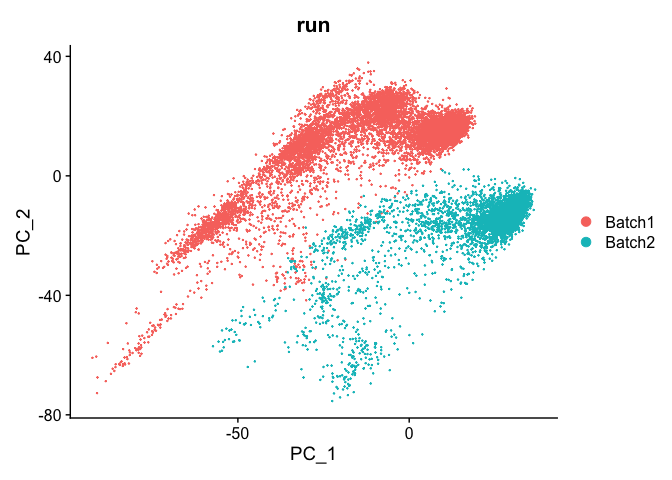
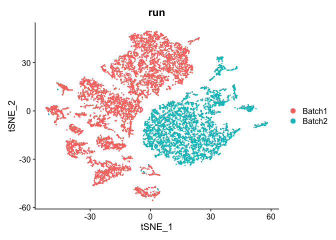
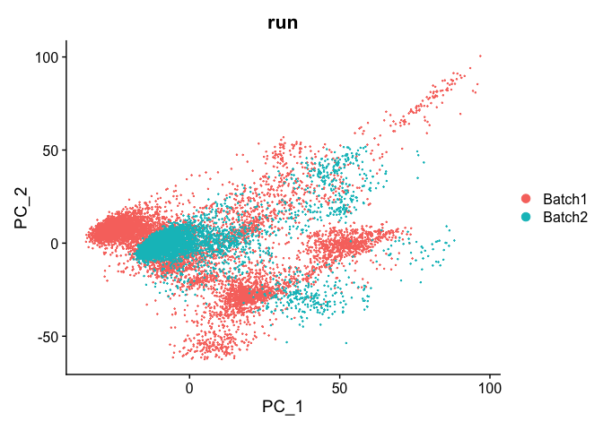
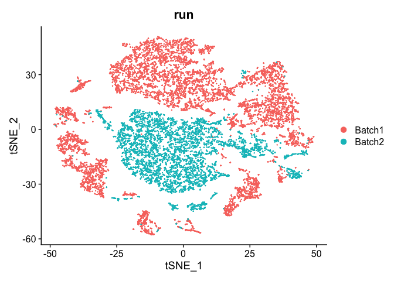
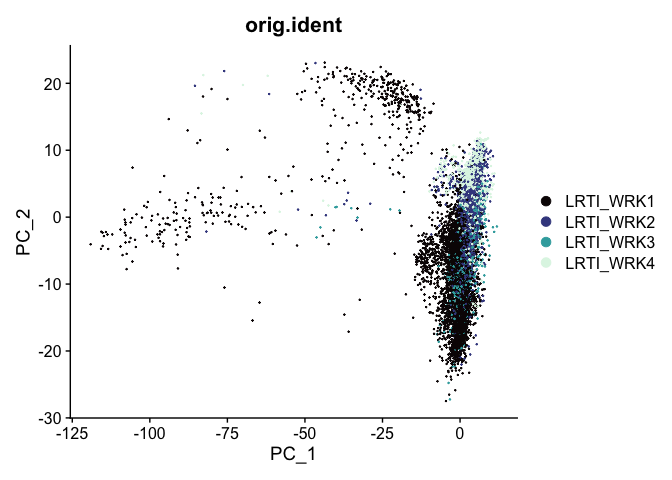
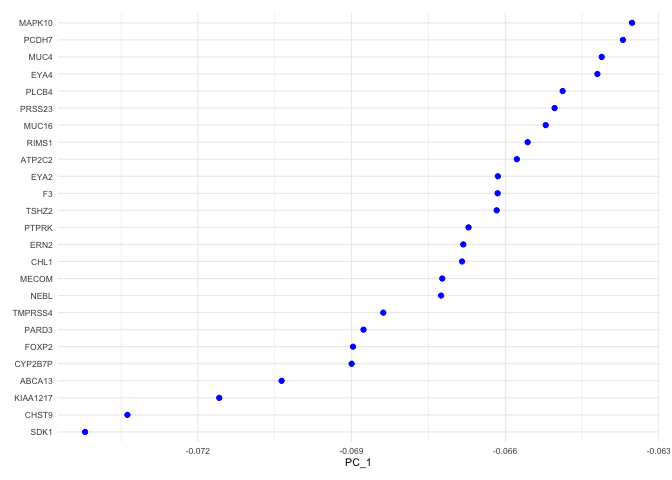
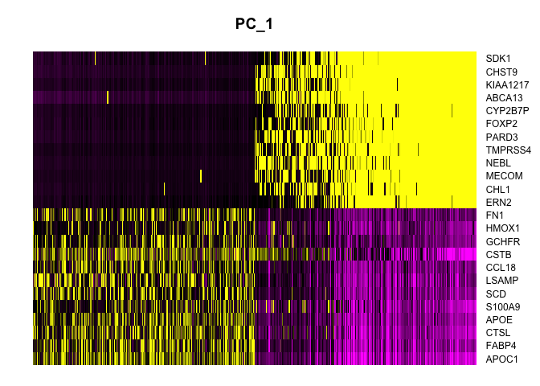
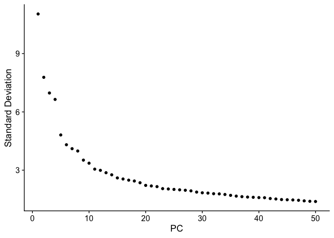
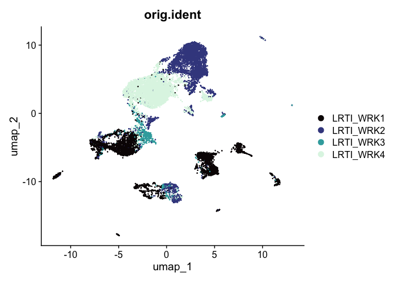

# Introduction to Single Cell RNA-Seq Part 4: Dimensionality reduction

Single cell (or nucleus) data are extremely high-dimensional. In order to reduce the complexity of analysis and remove sources of noise, dimensional reduction is an important step in the analysis workflow. In this section, we will be using two dimension reduction methods: PCA and UMAP.


## Set up workspace

``` r
library(Seurat)
library(ggplot2)
library(kableExtra)
library(dplyr)
```

Lets go ahead and set that common seed for everyone

``` r
set.seed(12345)
```

We will be continuing the work from Part 1 and so need to load in the RDS file

``` r
experiment.aggregate <- readRDS(file="scRNA_workshop-03.rds")
experiment.aggregate
```

```
## An object of class Seurat 
## 38606 features across 40052 samples within 1 assay 
## Active assay: RNA (38606 features, 2000 variable features)
##  2 layers present: counts, data
```

``` r
rand.cells <- sample(1:ncol(experiment.aggregate), ncol(experiment.aggregate)*0.35, replace = F)
experiment.aggregate <- experiment.aggregate[,rand.cells]
```
## Exploring Batch Effects


``` r
experiment.test <- experiment.aggregate

VariableFeatures(experiment.test) <- rownames(experiment.test)
set.seed(12345)


mat <- as.matrix(GetAssayData(experiment.test, slot="data"))
rand.genes <- sample(VariableFeatures(experiment.test), 500,replace = F)
mat[rand.genes,experiment.test$run=="Batch2"] <- mat[rand.genes,experiment.test$run=="Batch2"] + 0.22

experiment.test = SetAssayData(experiment.test, slot="data", new.data= mat )
rm(mat)
```

## Exploring Batch effects, none, Seurat [vars.to.regress]

First lets view the data without any corrections

## PCA in prep for tSNE

ScaleData - Scales and centers genes in the dataset.

``` r
?ScaleData
```


``` r
experiment.test.noc <- ScaleData(object = experiment.test)
```

### Run PCA

``` r
experiment.test.noc <- RunPCA(object = experiment.test.noc)
DimPlot(object = experiment.test.noc, group.by = "run", reduction = "pca")
```



We use 10 components in downstream analyses. Using more components more closely approximates the full data set but increases run time.

### TSNE Plot

``` r
pcs.use <- 10
experiment.test.noc <- RunTSNE(object = experiment.test.noc, dims = 1:pcs.use)
DimPlot(object = experiment.test.noc,  group.by = "run")
```



## Correct for sample to sample differences (seurat)

Use vars.to.regress to correct for the sample to sample differences and percent mitochondria

``` r
experiment.test.regress <- ScaleData(object = experiment.test,
                    vars.to.regress = c("run"), model.use = "linear")

experiment.test.regress <- RunPCA(object =experiment.test.regress,features=rownames(experiment.test.regress))
DimPlot(object = experiment.test.regress, group.by = "run", reduction = "pca")
```



### Corrected TSNE Plot

``` r
pcs.use <- 10
experiment.test.regress <- RunTSNE(object = experiment.test.regress, dims = 1:pcs.use)
DimPlot(object = experiment.test.regress,  group.by = "run")
```




## Scale the data for real this time

The `ScaleData` function scales and centers genes in the dataset. If variables are provided with the "vars.to.regress" argument, they are individually regressed against each gene, and the resulting residuals are then scaled and centered unless otherwise specified. We regress out cell cycle results S.Score and G2M.Score, mitochondrial RNA level (percent.mito), and the number of features (nFeature_RNA) as a proxy for sequencing depth.


``` r
experiment.aggregate <- ScaleData(experiment.aggregate,
                                  vars.to.regress = c("S.Score", "G2M.Score", "percent.mito", "nFeature_RNA"))
saveRDS(experiment.aggregate, file="scRNA_workshop-04_sd.rds")
```


## Perform dimensionality reduction with PCA
Principal Components Analysis (PCA) is a widely-used dimension reduction method. Each PC is a vector in the reduced-dimensional space that is orthogonal to all preceding PCs. The first of these explains the largest amount of variation and each subsequent PC explains slightly less than the preceding component. PCA is performed on the scaled data, and therefore uses only the variable features. 

``` r
?RunPCA
```


``` r
experiment.aggregate <- RunPCA(experiment.aggregate, npcs = 50)
```

While it is theoretically possible to calculate as many PCs as there are features in the data, typically 50 PCs is more than sufficient. In fact, many of these PCs may explain negligible amounts of variation. Seurat provides a number of ways to visualize the PCA results.

### Principal components plot
The PCA biplot is a scatter plot showing the placement of each cell on two selected components. By default, the first and second PC are used, but any two calculated PCs may be specified.

At this point in the analysis, since we are no longer performing QA and filtering, we can move to examining relationships between cells on a per-group rather than per-sample basis.

``` r
DimPlot(experiment.aggregate,
        group.by = "orig.ident",
        reduction = "pca",
        shuffle = TRUE) +
        scale_color_viridis_d(option = "mako")
```

<!-- -->

The axes are unit-less; points (cells or nuclei) that are farther apart are more dissimilar on the displayed PC than points that are closer together.

### PCA loadings
Each PC can be imagined as a sort of meta-gene for which every cell has an expression value. The top genes associated with the reduction component (i.e. contributing to a cell's "expression level" of that meta-gene) can be plotted for a selected dimension(s) using the `VizDimLoadings` function.

``` r
VizDimLoadings(experiment.aggregate,
               dims = 1,
               nfeatures = 25,
               reduction = "pca",
               ncol = 1) +
               theme_minimal(base_size = 8)
```

<!-- -->

### Heatmap
Heat maps display similar information. On the x-axis, cells are ordered by their embeddings ("expression" of the PC), while on the y-axis, genes are ordered by PC loading. When fewer than the total number of cells is selected, this results in selection of the cells with the largest absolute value embeddings, which emphasizes variation on the PC.

``` r
DimHeatmap(experiment.aggregate,
           dims = 1,
           nfeatures = 25,
           cells = 500,
           reduction = "pca",
           balanced = TRUE,
           slot = "scale.data")
```

<!-- -->

#### Explore
Re-import the original data and try modifying the ScaleData vars.to.regress argument. You could remove some variables, or add others. What happens? See how choices effect the plots.

``` r
experiment.explore <- readRDS("scRNA_workshop-03.rds")
experiment.explore <- ScaleData(experiment.explore) # make changes here to explore the data
experiment.explore <- RunPCA(experiment.explore) # what happens if you adjust npcs?
VizDimLoadings(experiment.explore, dims = 1:2)
DimPlot(experiment.explore, reduction = "pca")
DimHeatmap(experiment.explore, dims = 1:6, cells = 500, balanced = TRUE) # adjust parameters
```

## Selecting PCs to use
To overcome the extensive technical noise in any single gene, Seurat clusters cells based on their PCA scores, with each PC essentially representing a meta-gene that combines information across a correlated gene set. Determining how many PCs to include downstream is therefore an important step.

### Elbow plot
An elbow plot displays the standard deviations (or approximate singular values if running PCAFast) of the principle components for easy identification of an elbow in the graph. This elbow often corresponds well with the significant PCs and is much faster to run.  This is the traditional approach to selecting principal components.

The appearance of elbow plots tends to be highly consistent across single cell / single nucleus experiments. Generally, the line approaches zero at around PC 50. This is a reasonable number of PCs to use for the downstream steps.

``` r
ElbowPlot(experiment.aggregate, ndims = 50)
```

<!-- -->

### JackStraw
The JackStraw function randomly permutes a subset of data, and calculates projected PCA scores for these genes. The PCA scores for these randomly permuted genes are then compared with the observed PCA scores to determine statistical significance. The end result is a p-value for each gene's association with each principal component.

PCs with a strong enrichment of low p-value genes are identified as significant components.

**The JackStraw permutation is computationally intensive and can be quite slow. Consider skipping this step and exploring the function when you have some extra time.**

``` r
experiment.aggregate <- JackStraw(experiment.aggregate, dims = 100)
experiment.aggregate <- ScoreJackStraw(experiment.aggregate, dims = 1:100)
JackStrawPlot(object = experiment.aggregate, dims = 1:100) +
  scale_color_viridis_d() +
  theme(legend.position="bottom")
```

Let's use the first 50 PCs.


``` r
use.pcs <- 1:50
```

## UMAP
[Uniform Manifold Approximation and Projection](https://arxiv.org/pdf/1802.03426v3.pdf) (UMAP) is a dimensionality reduction method that is commonly used in single cell RNA-Seq analysis. Single cell data is extremely high-dimensional; UMAP calculates a nearest neighbor network describing the relationships between cells as measured by the PC loadings of variable genes and creates a low-dimensional space that preserves these relationships.

``` r
# calculate UMAP
experiment.aggregate <- RunUMAP(experiment.aggregate,
                                dims = use.pcs)
```

While UMAP can be a general non-linear dimensionality reduction approach, it's most frequently used as a visualization technique. A UMAP biplot offers a very useful graphical representation of the relationships captured by the nearest neighbor graph.


``` r
# UMAP colored by sample identity
DimPlot(experiment.aggregate,
        group.by = "orig.ident",
        reduction = "umap",
        shuffle = TRUE) +
  scale_color_viridis_d(option = "mako")
```

<!-- -->

## Prepare for the next section

#### Save object

``` r
saveRDS(experiment.aggregate, file="scRNA_workshop-04.rds")
```

#### Download Rmd

``` r
download.file("https://raw.githubusercontent.com/ucsf-cat-bioinformatics/2024-08-SCRNA-Seq-Analysis/main/data_analysis/05-clustering_celltype.Rmd", "05-clustering_celltype.Rmd")
```

#### Session information

``` r
sessionInfo()
```

```
## R version 4.4.1 (2024-06-14)
## Platform: aarch64-apple-darwin20
## Running under: macOS Sonoma 14.6.1
## 
## Matrix products: default
## BLAS:   /Library/Frameworks/R.framework/Versions/4.4-arm64/Resources/lib/libRblas.0.dylib 
## LAPACK: /Library/Frameworks/R.framework/Versions/4.4-arm64/Resources/lib/libRlapack.dylib;  LAPACK version 3.12.0
## 
## locale:
## [1] en_US.UTF-8/en_US.UTF-8/en_US.UTF-8/C/en_US.UTF-8/en_US.UTF-8
## 
## time zone: America/Los_Angeles
## tzcode source: internal
## 
## attached base packages:
## [1] stats     graphics  grDevices utils     datasets  methods   base     
## 
## other attached packages:
## [1] dplyr_1.1.4        kableExtra_1.4.0   ggplot2_3.5.1      Seurat_5.1.0      
## [5] SeuratObject_5.0.2 sp_2.1-4          
## 
## loaded via a namespace (and not attached):
##   [1] deldir_2.0-4           pbapply_1.7-2          gridExtra_2.3         
##   [4] rlang_1.1.4            magrittr_2.0.3         RcppAnnoy_0.0.22      
##   [7] spatstat.geom_3.3-2    matrixStats_1.3.0      ggridges_0.5.6        
##  [10] compiler_4.4.1         systemfonts_1.1.0      png_0.1-8             
##  [13] vctrs_0.6.5            reshape2_1.4.4         stringr_1.5.1         
##  [16] pkgconfig_2.0.3        fastmap_1.2.0          labeling_0.4.3        
##  [19] utf8_1.2.4             promises_1.3.0         rmarkdown_2.28        
##  [22] purrr_1.0.2            xfun_0.47              cachem_1.1.0          
##  [25] jsonlite_1.8.8         goftest_1.2-3          highr_0.11            
##  [28] later_1.3.2            spatstat.utils_3.1-0   irlba_2.3.5.1         
##  [31] parallel_4.4.1         cluster_2.1.6          R6_2.5.1              
##  [34] ica_1.0-3              spatstat.data_3.1-2    bslib_0.8.0           
##  [37] stringi_1.8.4          RColorBrewer_1.1-3     reticulate_1.38.0     
##  [40] spatstat.univar_3.0-0  parallelly_1.38.0      lmtest_0.9-40         
##  [43] jquerylib_0.1.4        scattermore_1.2        Rcpp_1.0.13           
##  [46] knitr_1.48             tensor_1.5             future.apply_1.11.2   
##  [49] zoo_1.8-12             sctransform_0.4.1      httpuv_1.6.15         
##  [52] Matrix_1.7-0           splines_4.4.1          igraph_2.0.3          
##  [55] tidyselect_1.2.1       abind_1.4-5            rstudioapi_0.16.0     
##  [58] yaml_2.3.10            spatstat.random_3.3-1  codetools_0.2-20      
##  [61] miniUI_0.1.1.1         spatstat.explore_3.3-2 listenv_0.9.1         
##  [64] lattice_0.22-6         tibble_3.2.1           plyr_1.8.9            
##  [67] withr_3.0.1            shiny_1.9.1            ROCR_1.0-11           
##  [70] evaluate_0.24.0        Rtsne_0.17             future_1.34.0         
##  [73] fastDummies_1.7.4      survival_3.7-0         polyclip_1.10-7       
##  [76] xml2_1.3.6             fitdistrplus_1.2-1     pillar_1.9.0          
##  [79] KernSmooth_2.23-24     plotly_4.10.4          generics_0.1.3        
##  [82] RcppHNSW_0.6.0         munsell_0.5.1          scales_1.3.0          
##  [85] globals_0.16.3         xtable_1.8-4           glue_1.7.0            
##  [88] lazyeval_0.2.2         tools_4.4.1            data.table_1.15.4     
##  [91] RSpectra_0.16-2        RANN_2.6.2             leiden_0.4.3.1        
##  [94] dotCall64_1.1-1        cowplot_1.1.3          grid_4.4.1            
##  [97] tidyr_1.3.1            colorspace_2.1-1       nlme_3.1-166          
## [100] patchwork_1.2.0        cli_3.6.3              spatstat.sparse_3.1-0 
## [103] spam_2.10-0            fansi_1.0.6            viridisLite_0.4.2     
## [106] svglite_2.1.3          uwot_0.2.2             gtable_0.3.5          
## [109] sass_0.4.9             digest_0.6.37          progressr_0.14.0      
## [112] ggrepel_0.9.5          farver_2.1.2           htmlwidgets_1.6.4     
## [115] htmltools_0.5.8.1      lifecycle_1.0.4        httr_1.4.7            
## [118] mime_0.12              MASS_7.3-61
```
