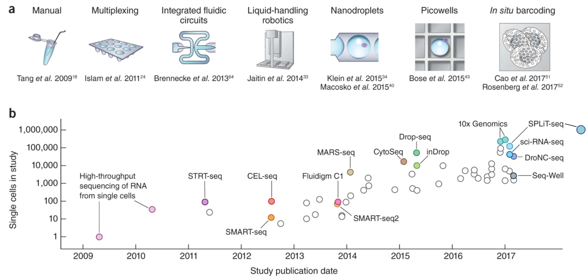
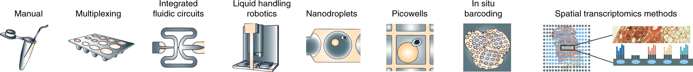
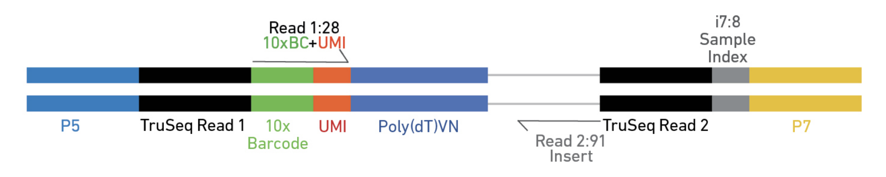
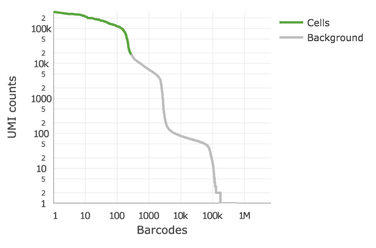
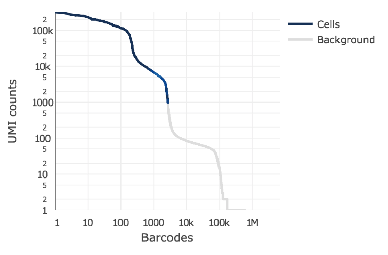

# Generating a Gene Expression Matrix

Bioinformatic analyses has two stages: data reduction followed by data analysis.

 Data analyses of scRNA-seq data take as their starting point an __expression matrix__, where each row represents a gene and each column represents a sample (in scRNA-Seq columns are cells). Each entry in the matrix represents the number of reads (proxy for expression level) of a particular gene in a given sample (cell). Generating the expression matrix, data reduction, often involves some, or all, of the following.

<div class="figure" style="text-align: center">

<p class="caption">Flowchart of scRNA-Seq analysis</p>
</div>

Because we are working with 10x Genomics data in this workshop, The 10x Cell Ranger application was used to handle the first column worth of steps (data reduction tasks).

### Preprocessing and Mapping Reads to a Genome

Raw fastq files first need to be preprocessed, extracting any elements that are a part of the sequence read and potentially "cleaned" with applications such as [`HTStream`](https://github.com/s4hts/HTStream).

* Library Barcode (library Index) - Used to pool multiple libraries onto one sequencing lane
* Cell Barcode – Used to identify the cell the read came from
* Unique Molecular Index (UMI) – Used to identify duplicate reads that arise during PCR replication
*  Sequencing Read – Used to identify the gene a read came from

Post preprocessing, the remaining sequences are mapped to a reference genome/trancriptome. 10x Genomics and Parse Biosciences both maintain custom preprocessing and alignment pipelines fine-tuned for their technologies. 10x's Cell Ranger is based on the [STAR](https://github.com/alexdobin/STAR) aligner. Another good choice is a pseudo-alignment method (e.g. [Kallisto](https://pachterlab.github.io/kallisto/), [Salmon](http://salmon.readthedocs.io/en/latest/salmon.html)). For __full-length__ datasets with tens- or hundreds of thousands of reads per cell pseudo-aligners become appealing since their run-time can be several orders of magnitude less than traditional aligners.

### Mapping QC

After aligning sequence data to the genome we should evaluate the quality of the mapping. There are many ways to measure the mapping quality, including: percentage mapped, amount of reads which map to rRNA/tRNAs, proportion of UMIproportion of uniquely mapped reads, reads mapping across splice junctions, read depth along the transcripts, etc. Methods developed for bulk RNAseq, such as [RSeQC](http://rseqc.sourceforge.net/) and [samtools](http://samtools.github.io/), are applicable to single-cell data.

### Gene Counting

STAR (and by extension, Cell Ranger), Kallisto, and Salmon all quantify the expression level of each gene for each cell as a part of its output. If UMIs were used, duplicates need to be first marked and then gene expression levels recounted. The package [`UMI-tools`](https://github.com/CGATOxford/UMI-tools) can be used to process and correct UMIs. The Parse Bioscience pipeline and Cell Ranger handle UMI deduplication and cell barcode assignment internally, producing an expression matrix that is ready for analysis.

Specific steps to be performed are dependent on the type of library, the element layout of the read, and the sequencing parameters.


[STAR](https://github.com/alexdobin/STAR), [Salmon](https://salmon.readthedocs.io/en/latest/alevin.html), [Kallisto/bustools](https://www.kallistobus.tools/) each have pipelines build specifically for processing single-cell datasets.


## scRNA-Seq Libraries

Generating scRNA-Seq libraries contiues to be an active area of research with several protocols being published in the last decade, including:

<div class="figure" style="text-align: center">

<p class="caption">The First Decade of scRNA-Seq Protocols</p>
</div>


<div class="figure" style="text-align: center">

<p class="caption">Current State of scRNA-Seq Protocols</p>
</div>


<p align = "right" style="font-family:Times;font-size:12px;">
Svensson, etc., 2018, Nature Protocols https://www.nature.com/articles/nprot.2017.149
Aldridge & Teichmann, 2020, Nature Communications https://www.nature.com/articles/s41467-020-18158-5
</p>


* CEL-seq, Hashimshony, 2012
* CEL-seq2, Hashimshony, 2016
* DroNC-seq, Habib, 2017
* Drop-seq, Macosko, 2015
* InDrop-seq, Klein, 2015
* MATQ-seq, Sheng, 2017_2018
* MARS-seq, Jaitin, 2014
* SCRB-seq, Soumillon, 2014
* Seq-well, Gierahn, 2017
* Smart-seq, Picelli, 2014
* Smart-seq2, Picelli, 2014
* SMARTer [clontech](http://www.clontech.com/US/Products/cDNA_Synthesis_and_Library_Construction/Next_Gen_Sequencing_Kits/Total_RNA-Seq/Universal_RNA_Seq_Random_Primed)
* STRT-seq, Islam, 2014
* SplitSeq, 2018 (now [Parse Biosciences](https://www.parsebiosciences.com/technology))
* Smart-seq3, Hagemann-Jensen, 2020
* Smart-seq-total, Isakova, 2021
* VASA-seq, Salmen, 2022

Methods differ in how they capture a cell and quantify gene expression (either __full-length__ or __tag-based__ , __whole-cell__ or __nucleus__).

__Full-length__ capture tries to achieve a uniform coverage of each transcript (many reads per transcript). __Tag-based__ protocols only capture either the 5'- or 3'-end of each transcript (single read per transcript). Choice in method determines what types of analyses the data can be used for. __Full-length__ capture can be used to distinguish different iso-forms, where __tag-based__ method is best used for only gene abundance.

* __Tag-based__ 3’ counting techniques
	* 1 read per transcript
	* Based on polyA
	* Expression analysis only
	* Fewer reads per cell needed (~20K reads/cell 10x V3+)
	* Less noise in expression patterns
* __Full-length__
	* _Based on polyA_
	* Expression analysis
	* Splicing information
	* The more information desired beyond expression, the higher the reads needed per cell (~50K reads/cell to 10M reads/cell)

### Long read sequencing

New Long read protocols have recently become available: PacBio [Kinnex single-cell RNA kit](https://www.pacb.com/products-and-services/applications/rna-sequencing/single-cell-rna-sequencing/) and ONT platforms [Ligation sequencing kit](https://nanoporetech.com/applications/investigations/single-cell-sequencing). These kits and application open up a whole new dimension to single cell analysis making transcript identification possible.

### Software

For smaller experiments < 5000 cells, the R packages [`SingleCellExperiment`](http://bioconductor.org/packages/SingleCellExperiment), [`scater`](http://bioconductor.org/packages/scater/), [`SC3`](http://bioconductor.org/packages/release/bioc/html/SC3.html) are good choices. For larger experiments (> 5000 cells), the R package [`Seurat`](http://satijalab.org/seurat/) offers a more complete solution.

If you prefer Python, [`scanpy`](https://scanpy.readthedocs.io/en/stable/) is a good choice.

A nice starting point to learn about single-cell software can be found [here](https://github.com/seandavi/awesome-single-cell).

## 10X Genomics generation of expression matrix with cellranger

10X Genomics [Cell Ranger](https://support.10xgenomics.com/single-cell-gene-expression/software/pipelines/latest/what-is-cell-ranger) uses a fork of the [`STAR`](https://github.com/alexdobin/STAR) aligner, [`Orbit`](https://github.com/10XGenomics/orbit), to map reads to a genome after first preprocessing them (extracting cell and UMI sequences).

<div class="figure" style="text-align: center">

<p class="caption">Elements to a 10x read (V3)</p>
</div>

cellranger cellranger-8.0.1

Process 10x Genomics Gene Expression, Feature Barcode, and Immune Profiling data

Usage: cellranger <COMMAND>

Commands:
* count           Count gene expression and/or feature barcode reads from a single sample and GEM well
*  multi           Analyze multiplexed data or combined gene expression/immune profiling/feature barcode data
*  multi-template  Providees template shows the possible cellranger multi config CSV options
*  vdj             Assembles single-cell VDJ receptor sequences from 10x Immune Profiling libraries
*  aggr            Aggregate data from multiple Cell Ranger runs
*  reanalyze       Re-run secondary analysis (dimensionality reduction, clustering, etc)
*  mkvdjref        Prepare a reference for use with CellRanger VDJ
*  mkfastq         Run Illumina demultiplexer on sample sheets that contain 10x-specific sample index sets
*  testrun         Execute the 'count' pipeline on a small test dataset
*  mat2csv         Convert a feature-barcode matrix to CSV format
*  mkref           Prepare a reference for use with 10x analysis software. Requires a GTF and FASTA
*  mkgtf           Filter a GTF file by attribute prior to creating a 10x reference
*  upload          Upload analysis logs to 10x Genomics support
*  sitecheck       Collect Linux system configuration information
*  help            Print this message or the help of the given subcommand(s)

In this workshop, we will only consider the use of the count sub-application.

Review the [cellranger-counts.sh](../software_scripts/scripts/cellranger-counts.sh) script used to map reads in the fastq files.

Cell Ranger likes all the __Raw Data__ fastq files, that are associated with a single library together under their own folder.

### Cell barcode and UMI filtering

* Cell barcodes
	* Must be on static list of known cell barcode sequences
	* May be 1 mismatch away from the list if the mismatch occurs at a low- quality position (the barcode is then corrected).

* UMIs (Unique Molecular Index)
	* Must not be a homopolymer, e.g. AAAAAAAAAA
	* Must not contain N
	* Must not contain bases with base quality < 10
	* UMIs that are 1 mismatch away from a higher-count UMI are corrected to that UMI if they share a cell barcode and gene.

### Read Trimming

Cell Ranger only performs read trimming to 3' gene expression assays.

A full length cDNA construct is flanked by the 30 bp template switch oligo (TSO) sequence, AAGCAGTGGTATCAACGCAGAGTACATGGG, on the 5' end and poly-A on the 3' end. Some fraction of sequencing reads are expected to contain either or both of these sequences, depending on the fragment size distribution of the sequencing library. Reads derived from short RNA molecules are more likely to contain either or both TSO and poly-A sequence than longer RNA molecules.

In order to improve mapping, the TSO sequence is trimmed from the 5' end of read 2 and poly-A is trimmed from the 3' end prior to alignment.

Tags ts:i and pa:i in the output BAM files indicate the number of TSO nucleotides trimmed from the 5' end of read 2 and the number of poly-A nucleotides trimmed from the 3' end, respectively. The trimmed bases are present in the sequence of the BAM record and are soft clipped in the CIGAR string.

### Alignment

#### Genome Alignment
Cell Ranger uses an aligner called Orbit (a wrapper around STAR), which performs splicing-aware alignment of reads to the genome. Cell Ranger uses the transcript annotation GTF to assign the reads to exonic, intronic, and intergenic categories, and by whether the reads align (confidently) to the genome. A read is exonic if at least 50% of it intersects an exon, intronic if it is non-exonic and intersects an intron, and intergenic otherwise.

#### MAPQ adjustment
For reads that align to a single exonic locus but also align to 1 or more non-exonic loci, the exonic locus is prioritized and the read is considered to be confidently mapped to the exonic locus with MAPQ 255.

#### Transcriptome Alignment
Cell Ranger further aligns exonic reads to annotated transcripts, looking for compatibility. A read that is compatible with the exons of an annotated transcript, and aligned to the same strand, is considered mapped to the transcriptome. If the read is compatible with a single gene annotation, it is considered uniquely (confidently) mapped to the transcriptome. Only reads that are confidently mapped to the transcriptome are used for UMI counting.

In certain cases, such as when the input to the assay consists of nuclei, there may be high levels of intronic reads generated by unspliced transcripts. In order to count these intronic reads, the _cellranger count_ and _cellranger multi_ pipelines can be run with the option 'include-introns' in versions 5.0-6.1. Starting from version 7.0, _cellranger count_ includes the intronic reads in quantification of gene expression by default, but can be turned off by setting _include-introns_ to false. The same applies to _cellranger multi_ pipeline. Counts produced with and without intronic reads are likely to differ more in single nucleus assays than in single cell assays due to an enrichment of un-spliced transcripts within the nuclear envelope.

### UMI Counting

* Using only the confidently mapped reads with valid barcodes and UMIs,
	* Correct the UMIs
		UMIs are corrected to more abundant UMIs that are one mismatch away in sequence (hamming distance = 1).
	* Record which reads are duplicates of the same RNA molecule (PCR duplicates)
	* Count only the unique UMIs as unique RNA molecules
	* These UMI counts form an unfiltered gene-barcode matrix.

````
/LRTI-WRK1_GXP
    _filelist
    _finalstate
    _invocation
    _jobmode
    _log
    LRTI-224_GXP.mri.tgz
    _mrosource
    outs/
    ├── analysis
    │   ├── clustering
    │   │   ├── gene_expression_graphclust
    │   │   │   └── clusters.csv
    │   │   ├── gene_expression_kmeans_10_clusters
    │   │   │   └── clusters.csv
    │   │   ├── gene_expression_kmeans_2_clusters
    │   │   │   └── clusters.csv
    │   │   ├── gene_expression_kmeans_3_clusters
    │   │   │   └── clusters.csv
    │   │   ├── gene_expression_kmeans_4_clusters
    │   │   │   └── clusters.csv
    │   │   ├── gene_expression_kmeans_5_clusters
    │   │   │   └── clusters.csv
    │   │   ├── gene_expression_kmeans_6_clusters
    │   │   │   └── clusters.csv
    │   │   ├── gene_expression_kmeans_7_clusters
    │   │   │   └── clusters.csv
    │   │   ├── gene_expression_kmeans_8_clusters
    │   │   │   └── clusters.csv
    │   │   └── gene_expression_kmeans_9_clusters
    │   │       └── clusters.csv
    │   ├── diffexp
    │   │   ├── gene_expression_graphclust
    │   │   │   └── differential_expression.csv
    │   │   ├── gene_expression_kmeans_10_clusters
    │   │   │   └── differential_expression.csv
    │   │   ├── gene_expression_kmeans_2_clusters
    │   │   │   └── differential_expression.csv
    │   │   ├── gene_expression_kmeans_3_clusters
    │   │   │   └── differential_expression.csv
    │   │   ├── gene_expression_kmeans_4_clusters
    │   │   │   └── differential_expression.csv
    │   │   ├── gene_expression_kmeans_5_clusters
    │   │   │   └── differential_expression.csv
    │   │   ├── gene_expression_kmeans_6_clusters
    │   │   │   └── differential_expression.csv
    │   │   ├── gene_expression_kmeans_7_clusters
    │   │   │   └── differential_expression.csv
    │   │   ├── gene_expression_kmeans_8_clusters
    │   │   │   └── differential_expression.csv
    │   │   └── gene_expression_kmeans_9_clusters
    │   │       └── differential_expression.csv
    │   ├── pca
    │   │   └── gene_expression_10_components
    │   │       ├── components.csv
    │   │       ├── dispersion.csv
    │   │       ├── features_selected.csv
    │   │       ├── projection.csv
    │   │       └── variance.csv
    │   ├── tsne
    │   │   └── gene_expression_2_components
    │   │       └── projection.csv
    │   └── umap
    │       └── gene_expression_2_components
    │           └── projection.csv
    ├── cloupe.cloupe
    ├── filtered_feature_bc_matrix
    │   ├── barcodes.tsv.gz
    │   ├── features.tsv.gz
    │   └── matrix.mtx.gz
    ├── filtered_feature_bc_matrix.h5
    ├── metrics_summary.csv
    ├── molecule_info.h5
    ├── possorted_genome_bam.bam
    ├── possorted_genome_bam.bam.bai
    ├── raw_feature_bc_matrix
    │   ├── barcodes.tsv.gz
    │   ├── features.tsv.gz
    │   └── matrix.mtx.gz
    ├── raw_feature_bc_matrix.h5
    └── web_summary.html
    _perf
    _perf._truncated_
    SC_RNA_COUNTER_CS/
    ├── Pipeline output
    _sitecheck
    _tags
    _timestamp
    _uuid
    _vdrkill
    _versions
````
### Filtering cells

Cell Ranger 3.0 introduced and improved cell-calling algorithm that is better able to identify populations of low RNA content cells, especially when low RNA content cells are mixed into a population of high RNA content cells. For example, tumor samples often contain large tumor cells mixed with smaller tumor infiltrating lymphocytes (TIL) and researchers may be particularly interested in the TIL population. The new algorithm is based on the EmptyDrops method (Lun et al., 2019).

The algorithm has two key steps:

1. It uses a cutoff based on total UMI counts of each GEM barcode to identify cells. This step identifies the primary mode of high RNA content cells.
2. Then the algorithm uses the RNA profile of each remaining barcode to determine if it is an “empty" or a cell containing partition. This second step captures low RNA content cells whose total UMI counts may be similar to empty GEMs.

In the first step, the original  cell calling algorithm is used to identify the primary mode of high RNA content cells, using a cutoff based on the total UMI count for each barcode. Cell Ranger may take as input the expected number of recovered cells, N (see --expect-cells). Let m be the 99th percentile of the top N barcodes by total UMI counts. All barcodes whose total UMI counts exceed m/10 are called as cells in the first pass.

In the second step, a set of barcodes with low UMI counts that likely represent ‘empty’ GEM partitions is selected. A model of the RNA profile of selected barcodes is created. This model, called the background model, is a multinomial distribution over genes. It uses [Simple Good-Turing smoothing](https://en.wikipedia.org/wiki/Good%E2%80%93Turing_frequency_estimation) to provide a non-zero model estimate for genes that were not observed in the representative empty GEM set. Finally, the RNA profile of each barcode not called as a cell in the first step is compared to the background model. Barcodes whose RNA profile strongly disagrees with the background model are added to the set of positive cell calls. This second step identifies cells that are clearly distinguishable from the profile of empty GEMs, even though they may have much lower RNA content than the largest cells in the experiment.

Below is an example of a challenging cell-calling scenario where 300 high RNA content 293T cells are mixed with 2000 low RNA content PBMC cells. On the left is the cell calling result with the cell calling algorithm prior to Cell Ranger 3.0 and on the right is the current Cell Ranger 3.0 result. You can see that low RNA content cells are successfully identified by the new algorithm.

<p float="center">
  
  
</p>

### Matrix output

| Type	|		| Description |
|:----- |:---		|:------ |
| raw_feature_bc_matrix	| | Folder containing gene-barcode matrices.	Contains every barcode from fixed list of known-good barcode sequences that have at least 1 read. This includes background and non-cellular barcodes. |
| filtered_feature_bc_matrix | | Folder containing gene-barcode matrices.	Contains only detected cellular barcodes. |

Each of these folders contains three files needed to completely describe each gene x cell matrix:

- matrix.mtx.gz
- features.tsv.gz
- barcode.tsv.gz


### Matrix HDF5 output

| Type	|		| Description |
|:----- |:---		|:------ |
| raw_feature_bc_matrix.h5	| | hdf5 file with gene-barcode matrices	Contains every barcode from fixed list of known-good barcode sequences that have at least 1 read. This includes background and non-cellular barcodes. |
| filtered_feature_bc_matrix.h5 | | hdf5 file with gene-barcode matrices	Contains only detected cellular barcodes. |

HDF5 is a file format designed to preserve a hierarchical, filesystem-like organization of large amounts of data:

```
(root)
└── matrix [HDF5 group]
    ├── barcodes
    ├── data
    ├── indices
    ├── indptr
    ├── shape
    └── features [HDF5 group]
        ├─ _all_tag_keys
        ├─ target_sets [for Targeted Gene Expression]
        │   └─ [target set name]
        ├─ feature_type
        ├─ genome
        ├─ id
        ├─ name
        ├─ pattern [Feature Barcode only]
        ├─ read [Feature Barcode only]
        └─ sequence [Feature Barcode only]
```

The result is a single file completely describing the gene x cell matrix, which can be read into R or Python for downstream processing.

The hdf5 has a number of advantages we'll talk more about when we get into data analysis.

### BAM output

10x Chromium cellular and molecular barcode information for each read is stored as TAG fields:

| Tag	| Type	| Description
|:----- |:------ |:----- |
| CB	| Z		| Chromium cellular barcode sequence that is error-corrected and confirmed against a list of known-good barcode sequences. |
| CR	| Z		| Chromium cellular barcode sequence as reported by the sequencer. |
| CY	| Z		| Chromium cellular barcode read quality. Phred scores as reported by sequencer. |
| UB	| Z		| Chromium molecular barcode sequence that is error-corrected among other molecular barcodes with the same cellular barcode and gene alignment. |
| UR	| Z		| Chromium molecular barcode sequence as reported by the sequencer. |
| UY	| Z		| Chromium molecular barcode read quality. Phred scores as reported by sequencer. |
| TR	| Z		| Trimmed sequence. For the Single Cell 3' v1 chemistry, this is trailing sequence following the UMI on Read 2. For the Single Cell 3' v2 chemistry, this is trailing sequence following the cell and molecular barcodes on Read 1. |


The following TAG fields are present if a read maps to the genome __and__ overlaps an exon by at least one base pair. A read may align to multiple transcripts and genes, but it is only considered confidently mapped to the transcriptome it if mapped to a single gene.


| Tag	| Type	| Description
|:----- |:------ |:----- |
| TX	| Z		| Semicolon-separated list of transcripts that are compatible with this alignment. Transcripts are specified with the transcript_id key in the reference GTF attribute column. The format of each entry is [transcript_id],[strand][pos],[cigar], where strand is either + or -, pos is the alignment offset in transcript coordinates, and cigar is the CIGAR string in transcript coordinates. |
| AN	| Z		| Same as the TX tag, but for reads that are aligned to the antisense strand of annotated transcripts. If introns are included, this tag contains the corresponding antisense gene identifier. |
| GX	| Z		| Semicolon-separated list of gene IDs that are compatible with this alignment. Gene IDs are specified with the gene_id key in the reference GTF attribute column. |
| GN	| Z		| Semicolon-separated list of gene names that are compatible with this alignment. Gene names are specified with gene_name key in the reference GTF attribute column. |
| MM	| i		| Set to 1 if the genome-aligner (STAR) originally gave a MAPQ < 255 (it multi-mapped to the genome) and cellranger changed it to 255 because the read overlapped exactly one gene. |
| RE	| A		| Single character indicating the region type of this alignment (E = exonic, N = intronic, I = intergenic). |
| pa	| i	 | The number of poly-A nucleotides trimmed from the 3' end of read 2. Up to 10% mismatches are permitted. |
| ts	| i	 | The number of template switch oligo (TSO) nucleotides trimmed from the 5' end of read 2. Up to 3 mismatches are permitted. The 30-bp TSO sequence is AAGCAGTGGTATCAACGCAGAGTACATGGG. |
| xf	| i	 | Extra alignment flags. |


The bits to the extra alignment flags are interpreted as follows:
* 1 - The read is confidently mapped to a feature
* 2 - The read maps to a feature that the majority of other reads with this UMI did not
* 4 - This read pair maps to a discordant pair of genes, and is not treated as a UMI count
* 8 - This read is representative for a transcriptomic molecule and can be treated as a UMI count
* 16 - This read maps to exactly one feature, and is identical to bit 8 for transcriptomic reads. Notably, this bit is set when a feature barcode read is treated as a UMI count, while bit 8 is not
* 32 - This read was removed by targeted UMI filtering.


The following are feature barcoding TAG fields which are not aligned to the genome, but processed by the Feature Barcoding read processor. The BAM file will contain unaligned records for these reads, with the following tags representing the Feature Barcode sequence extracted from the read, and the feature reference it was matched to, if any. The BAM read sequence will contain all the bases outside of the cell barcode and UMI regions. V3 ONLY.

| Tag	| Type	| Description
|:----- |:------ |:----- |
| fb	| Z		| Chromium Feature Barcode sequence that is error-corrected and confirmed against known features barcode sequences from the feature reference. |
| fr	| Z		| Chromium Feature Barcode sequence as reported by the sequencer. |
| fq	| Z		| Chromium Feature Barcode read quality. Phred scores as reported by sequencer. |
| fx	| Z		| Feature identifier matched to this Feature Barcode read. Specified in the id column of the feature reference. |

#### An example read

Cell Ranger Version 6

```
A01102:107:HHM5TDSXY:3:1128:6659:34601	147	chr1	1014050	255	151M	=	1013467	-734	TCGGTGTCAGAGCTGAAGGCGCAGATCACCCAGAAGATCGGCGTGCACGCCTTCCAGCAGCGTCTGGCTGTCCACCCGAGCGGTGTGGCGCTGCAGGACAGGGTCCCCCTTGCCAGCCAGGGCCTGGGCCCCGGCAGCACGGTCCTGCTGG	FFFFFFFFFFFFFFFFFFFFFFFFFFFFFFFFFFFFFFFFFFFFFFFFFFFFFFFFFFFFFFFFFFFFFFFFFFFFFFFFFFFFFFFFFFFFFFFFFFFFFFFFFFFFFFFFFFFFFFFFFFFFFFFFFFFFFFFFFFFFFFFFFFFFFFF	NH:i:1	HI:i:1	AS:i:249	nM:i:2	RG:Z:PBMC2sm:0:1:HHM5TDSXY:3	TX:Z:ENST00000624652,+271,151M;ENST00000624697,+296,151M;ENST00000649529,+146,151M	GX:Z:ENSG00000187608	GN:Z:ISG15	fx:Z:ENSG00000187608	RE:A:E	xf:i:25	CR:Z:CCGTGGAGTCAGAGGT	CY:Z:FFFFFF:FFFFFFFFF	CB:Z:CCGTGGAGTCAGAGGT-1	UR:Z:CCACGGGGAT	UY:Z:FFFFFFFFFF	UB:Z:CCACGGGGAT
```

### 10X Genomics sample report

A summary of the alignment and assignment of reads to cells and genes is present in the metrics_summary.csv.

| Metric	| Description |
|:----- 		|:------ |
| Estimated Number of Cells	| The number of barcodes associated with cell-containing partitions, estimated from the barcode UMI count distribution. |
| Mean Reads per Cell	| The total number of sequenced reads divided by the estimated number of cells. |
| Median Genes per Cell	| The median number of genes detected (with nonzero UMI counts) across all cell-associated barcodes. |
| Number of Reads	| Total number of sequenced reads. |
| Valid Barcodes	| Fraction of reads with cell-barcodes that match the whitelist. |
| Sequencing Saturation	| The fraction of reads originating from an already-observed UMI. This is a function of library complexity and sequencing depth. More specifically, this is the fraction of confidently mapped, valid cell-barcode, valid UMI reads that had a non-unique (cell-barcode, UMI, gene). This metric was called "cDNA PCR Duplication" in versions of cellranger prior to 1.2. |
| Q30 Bases in Barcode	| Fraction of bases with Q-score at least 30 in the cell barcode sequences. This is the i7 index (I1) read for the Single Cell 3' v1 chemistry and the R1 read for the Single Cell 3' v2 chemistry. |
| Q30 Bases in RNA Read	| Fraction of bases with Q-score at least 30 in the RNA read sequences. This is Illumina R1 for the Single Cell 3' v1 chemistry and Illumina R2 for the Single Cell 3' v2 chemistry. |
| Q30 Bases in UMI	| Fraction of bases with Q-score at least 30 in the UMI sequences. This is the R2 read for the Single Cell 3' v1 chemistry and the R1 read for the Single Cell 3' v2 chemistry. |
| Reads Mapped to Genome | Fraction of reads that mapped to the genome.|
| Reads Mapped Confidently to Genome | Reads Mapped Confidently to Genome. |
| Reads Mapped Confidently to Intergenic Regions	| Fraction of reads that mapped to the intergenic regions of the genome with a high mapping quality score as reported by the aligner. |
| Reads Mapped Confidently to Intronic Regions	| Fraction of reads that mapped to the intronic regions of the genome with a high mapping quality score as reported by the aligner. |
| Reads Mapped Confidently to Exonic Regions	| Fraction of reads that mapped to the exonic regions of the genome with a high mapping quality score as reported by the aligner. |
| Reads Mapped Confidently to Transcriptome	| Fraction of reads that mapped to a unique gene in the transcriptome with a high mapping quality score as reported by the aligner. |
| Reads Mapped Antisense to Gene | Fraction of reads confidently mapped to the transcriptome, but on the opposite strand of their annotated gene. A read is counted as antisense if it has any alignments that are consistent with an exon of a transcript but antisense to it, and has no sense alignments. |
| Fraction Reads in Cells	| The fraction of cell-barcoded, confidently mapped reads with cell-associated barcodes. |
| Total Genes Detected	| The number of genes with at least one UMI count in any cell. |
| Median UMI Counts per Cell	| The median number of total UMI counts across all cell-associated barcodes. |

### 10X genomics html reports

Cell Ranger does produce a more readable HTML report with the same statistics and some "analysis".

[Cell Ranger V8 web summary GEX](web_summary.html)

Download the workshop sample data (2 samples), the instructor will provide the download link.

## Exercises

	1. Explore the folder 01-CellRanger. Is it the whole output tree described above?
	2. Which output folders/files contain the expression matrix?
	3. Review the metrics_summary.csv file. What was the total number of reads in this sample?
	4. Use `gunzip` and `head` to look at the first few lines of the files under raw_feature_bc_matrix. What format is the matrix file in? How would you read the data.
---
